<div align="center">

<h1>
<picture>
  <source media="(prefers-color-scheme: dark)" srcset="brand/kit/wordmark/revenuedot-lockup-white.svg">
  
</picture>
</h1>

### The open-source RevenueCat alternative

**Open-source monetization infrastructure for mobile apps: the SDKs, the server, paywalls, experiments, web checkout, Customer Center, 43 charts and 36 integrations, in one codebase you can run yourself.**<br>
It works with the RevenueCat SDK your app already ships, so you switch by changing one line of code.

RevenueDot is the open-source RevenueCat alternative: the first release is [v2026.10.03](https://github.com/revenuedot/revenuedot/releases/tag/v2026.10.03), it has run in production beside RevenueCat since 2026-10-02, and RevenueDot Cloud is free up to $10,000 a month in tracked revenue, then 0.5%, never more than $999 a month.

**[Start free on RevenueDot Cloud](https://app.revenuedot.app/signup)** · [Self-host](#self-host) · [Migrate from RevenueCat](#migrate-from-revenuecat-in-three-steps) · [Docs](https://revenuedot.app/docs) · [Pricing](#pricing) · [Compare](#revenuedot-compared) · [FAQ](#faq)

[](LICENSING.md)
[](#sdks)
[](#compatibility)
[](https://github.com/revenuedot/revenuedot/actions/workflows/deploy.yml)
[](https://www.npmjs.com/package/revenuedot)
[](https://github.com/revenuedot/revenuedot/stargazers)

<br>

<a href="https://revenuedot.app/videos/revenuedot-dashboard-tour.mp4"><picture><source media="(prefers-color-scheme: dark)" srcset="docs/assets/readme/hero-dark.gif">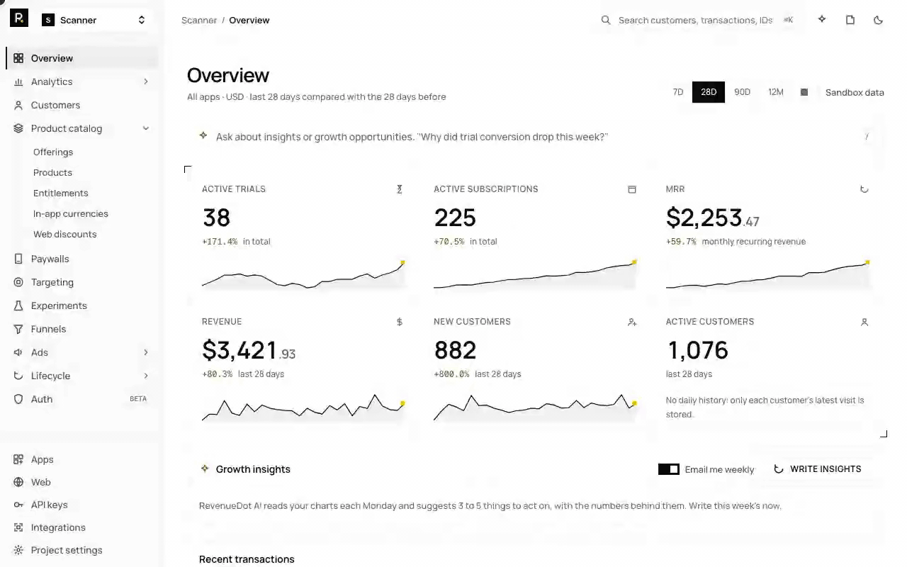</picture></a>

<sub>Example data. <a href="https://revenuedot.app/videos/revenuedot-dashboard-tour.mp4">Watch the dashboard tour</a> · <a href="https://revenuedot.app/videos/revenuedot-chatgpt-demo.mp4">87 seconds of RevenueDot run from ChatGPT</a> · <a href="https://revenuedot.app/videos/revenuedot-platform-demo.mp4">The whole platform in 2½ minutes</a> (<a href="https://www.youtube.com/watch?v=iZH8eTC5B1c">on YouTube</a>)</sub>

</div>

## In one minute

- **What it is:** an open-source server that verifies App Store and Google Play purchases, keeps every customer's entitlements current from store notifications, and sends webhooks to your backend, with the paywalls, experiments, web checkout, Customer Center, charts and integrations that normally cost a second vendor.
- **Why it is different:** it implements the API the RevenueCat SDKs call, so an app that uses the RevenueCat SDK switches by setting one URL. No purchase code to rewrite, no SDK to swap, no subscriber lost.
- **How you run it:** `docker compose up` on your own servers, free with no limits, or [RevenueDot Cloud](https://app.revenuedot.app/signup), free up to $10,000 a month in tracked revenue and never more than $999 a month after that.
- **Who it is for:** subscription apps on iOS, Android and the web, from a solo developer's first paywall to a studio running fourteen apps and a company that needs SSO, data location and an audit trail.
- **Status:** first release [v2026.10.03](https://github.com/revenuedot/revenuedot/releases/tag/v2026.10.03). A real App Store sandbox purchase ran end to end on a physical iPhone on 2026-10-02, a production app has run RevenueDot beside RevenueCat since 2026-10-02, and RevenueDot Cloud has billed real cards through Stripe since 2026-10-03. Google Play, Amazon, Paddle, Roku and Galaxy Store are tested against copies of each store's API; their first real purchases are next. Feature by feature: [docs/STATUS.md](docs/STATUS.md).

## Contents

- [The whole stack, open source](#the-whole-stack-open-source)
- [Proof](#proof)
- [Migrate from RevenueCat in three steps](#migrate-from-revenuecat-in-three-steps)
- [How it works](#how-it-works)
- [Pricing](#pricing)
- [RevenueDot compared](#revenuedot-compared)
- [Features](#features)
- [SDKs](#sdks)
- [Compatibility](#compatibility)
- [Self-host](#self-host)
- [RevenueDot Cloud](#revenuedot-cloud)
- [Built for AI agents](#built-for-ai-agents)
- [Repository map](#repository-map)
- [Roadmap](#roadmap)
- [FAQ](#faq)
- [Contributing](#contributing) · [Security](#security) · [License](#license)

## The whole stack, open source

RevenueDot is the only open-source product that ships every layer a subscription app needs, as of October 2026 ([comparisons with sources](https://revenuedot.app/compare)). RevenueCat, Superwall, Adapty, Qonversion and Apphud publish their SDKs and keep the server closed; the earlier open-source attempts cover one store or one feature.

| Layer | What ships |
|---|---|
| **SDKs** | MIT forks of all ten RevenueCat SDKs (iOS, Android, React Native and Expo, Flutter, web, Capacitor, Kotlin Multiplatform, Unity, Cordova) with the same classes and methods, on CocoaPods, Maven Central, npm, pub.dev and OpenUPM. Or keep the stock RevenueCat SDK and set one URL |
| **Server** | Purchases verified with the App Store Server API and the Play Developer API, entitlements kept current from Server Notifications v2 and real-time developer notifications, Amazon Appstore, Stripe, Paddle, Roku and Galaxy Store, grace periods, billing retry, refunds, upgrades, transfers, offline entitlements, promotional offers and win-back offers |
| **API and webhooks** | The RevenueCat-compatible REST API: all 15 v1 endpoints and all 128 v2 operations, the same shapes, pagination and errors. Webhooks with RevenueCat's event names and payloads, signed, retried, replayable |
| **Paywalls** | Native paywalls the SDKs render (all 17 component types), ten templates, a visual editor with layers, versions, light and dark, translations, and "Generate with AI" |
| **Experiments and targeting** | A/B tests on price, trial, duration, ordering and paywall design with lift, 95% intervals and chance to beat control; targeting rules with placements and schedules; saved audiences |
| **Web** | Checkout on your own Stripe account with no fee from RevenueDot, purchase links, no-code web-to-app funnels, redemption links that unlock web purchases in the app, discount codes, your own domain |
| **Customer Center and lifecycle** | The in-app Customer Center (cancel surveys, offers, 33 languages), Refund Control that answers Apple's refund requests inside the 12-hour window, failed-payment recovery emails, win-back campaigns, support tickets, blocked customers |
| **Analytics** | 43 charts with RevenueCat's definitions, filters and segments, the customers behind every number, annotations, share links, revenue by ad campaign with ROAS, opt-in benchmarks, weekly AI growth insights, a public Verified Metrics page |
| **Integrations** | 36 integrations with RevenueCat's event names and reserved attributes: AppsFlyer, Adjust, Branch, Singular, Kochava, Tenjin, Airbridge, Apple Search Ads and Meta Ads; Amplitude, Mixpanel, PostHog, Segment, Firebase, mParticle, Statsig, BigQuery; Braze, Customer.io, Iterable, OneSignal, Airship, CleverTap; Intercom, Zendesk, Slack, Discord, AdMob; scheduled CSV or Parquet exports to S3, R2 and Google Cloud Storage |
| **AI** | A hosted MCP server, agent skills for Claude Code, Codex and Cursor, `llms.txt`, and RevenueDot AI inside the dashboard, which answers from your data and changes things only after you approve |
| **Enterprise** | Organizations, custom roles from the 33 API scopes, SSO with SAML 2.0 and OpenID Connect, SCIM 2.0, data location per project, audit retention to ten years, signed compliance exports |
| **Run it anywhere** | Docker Compose, a Helm chart, Terraform for AWS and Google Cloud, or RevenueDot Cloud. One command moves a project between them with the same ids and keys |

<table>
<tr>
<td width="50%"><picture><source media="(prefers-color-scheme: dark)" srcset="docs/assets/readme/paywall-editor-dark.png">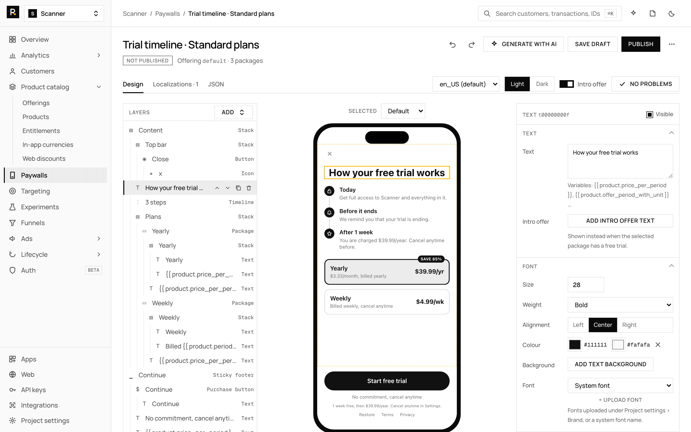</picture><br><sub><b>Paywalls.</b> Native paywalls, a visual editor and templates. Changes ship without an app update.</sub></td>
<td width="50%"><picture><source media="(prefers-color-scheme: dark)" srcset="docs/assets/readme/experiments-dark.png">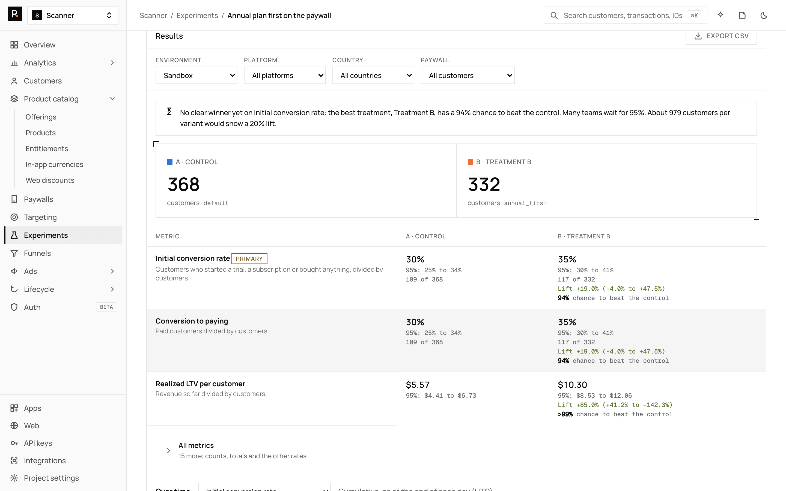</picture><br><sub><b>Experiments.</b> Price, trial and paywall tests with lift and confidence intervals.</sub></td>
</tr>
<tr>
<td width="50%"><picture><source media="(prefers-color-scheme: dark)" srcset="docs/assets/readme/charts-dark.png">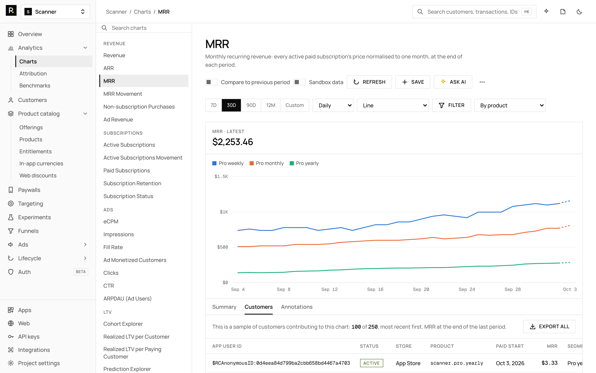</picture><br><sub><b>Charts.</b> 43 charts with RevenueCat's definitions, segments and the customers behind every number.</sub></td>
<td width="50%"><picture><source media="(prefers-color-scheme: dark)" srcset="docs/assets/readme/funnels-dark.png">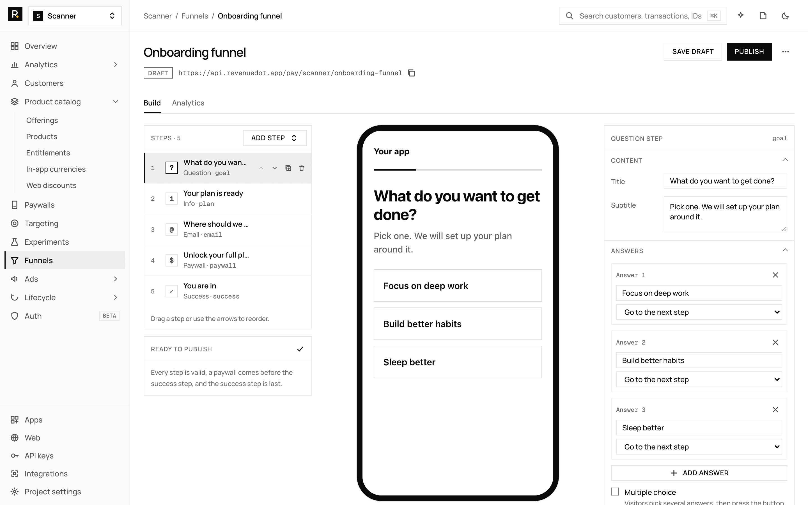</picture><br><sub><b>Web-to-app funnels.</b> No-code funnels and checkout on your own Stripe account.</sub></td>
</tr>
<tr>
<td width="50%"><picture><source media="(prefers-color-scheme: dark)" srcset="docs/assets/readme/customer-center-dark.png">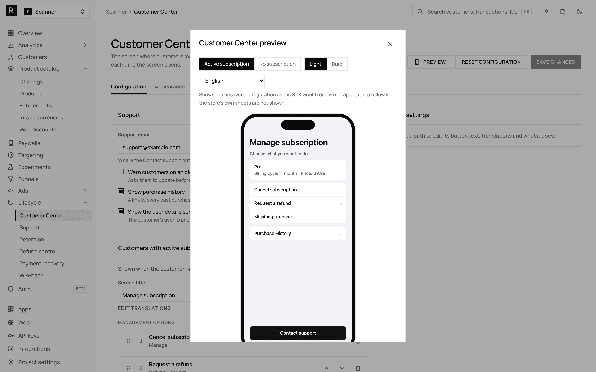</picture><br><sub><b>Customer Center.</b> Cancel surveys, offers and refunds inside the app, in 33 languages.</sub></td>
<td width="50%"><picture><source media="(prefers-color-scheme: dark)" srcset="docs/assets/readme/integrations-dark.png">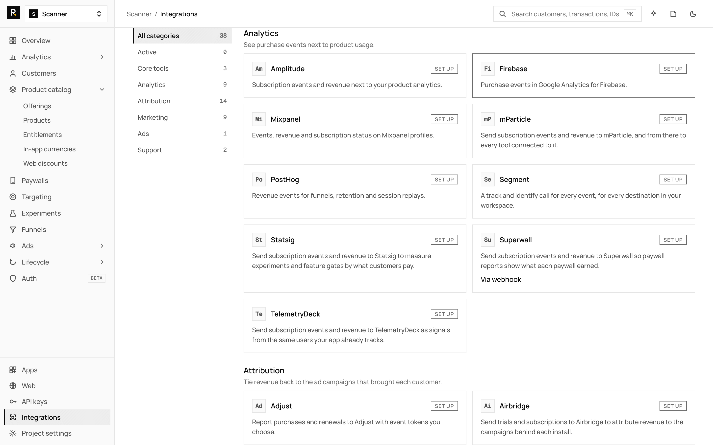</picture><br><sub><b>Integrations.</b> Every purchase event in AppsFlyer, Adjust, Amplitude, Mixpanel, Braze and 31 more.</sub></td>
</tr>
</table>

Video: [Build a paywall and test it in minutes](https://www.youtube.com/watch?v=daXVK_4XD8I) (1:04).

## Proof

- **Compatibility is tested, not claimed.** Every build runs RevenueCat's own SDK test fixtures (94 request and response samples and 21 webhook samples) and RevenueCat's published OpenAPI files; a change that breaks one does not merge. The unmodified RevenueCat iOS SDK 5.92 and Android SDK 10.24 complete purchases against RevenueDot on the simulator and emulator ([`scripts/e2e`](scripts/e2e)).
- **Real stores.** A real App Store sandbox purchase on a physical iPhone unlocked access end to end on 2026-10-02: Apple's purchase sheet, Apple's notification into RevenueDot Cloud, an `INITIAL_PURCHASE` webhook, Pro unlocked in the app. A production app has run RevenueDot and RevenueCat side by side since 2026-10-02, with RevenueDot processing its live store notifications and forwarding each one to RevenueCat. Real Stripe test-mode purchases, renewals, failed payments and refunds ran on 2026-10-03. Google Play, Amazon, Paddle, Roku and Galaxy Store are built and tested against copies of each store's API; their first real purchases are next. The exact state of every feature: [docs/STATUS.md](docs/STATUS.md).
- **1,700 tests on every pull request,** on an in-memory Postgres and on a real one, plus browser tests of the dashboard. CI takes under three minutes and every merge deploys.
- **Leave any time.** A full export of all 70 tables with checksums, and one command that moves a project between Cloud and your own server, either way, with the same ids, SDK keys and webhook secrets.

## Migrate from RevenueCat in three steps

1. **Import.** Run the importer on your own machine with your own RevenueCat secret API key. It brings over products, entitlements, offerings, customers, attributes and purchase history. Your existing public API keys keep working, and current access is imported so nobody loses access on switch day.
   ```bash
   npx revenuedot import --from-revenuecat --rc-project <RevenueCat project id> --to https://api.revenuedot.app
   ```
   It asks for your RevenueCat and RevenueDot secret keys and hides what you type, so they stay out of your shell history. The CLI is on npm as [`revenuedot`](https://www.npmjs.com/package/revenuedot) ([guide](https://revenuedot.app/docs/migrate/importer)). `import verify` then checks every customer on both sides.
2. **Run side by side.** Point App Store and Google Play notifications at RevenueDot. It forwards every notification to RevenueCat, so both systems stay accurate while you compare them.
3. **Switch.** Ship an app update that sets the proxy URL. When most users are on the new version, turn RevenueCat off.

Video: [Migrate from RevenueCat without losing a renewal](https://www.youtube.com/watch?v=Smjskzwwo7o) (1:34).

<details>
<summary><b>The one line, for every SDK</b></summary>

```swift
// iOS, macOS, tvOS, watchOS, visionOS (Swift): before configure
Purchases.proxyURL = URL(string: "https://api.revenuedot.app")!
Purchases.configure(withAPIKey: "appl_...")
```

```kotlin
// Android (Kotlin): before configure
Purchases.proxyURL = URL("https://api.revenuedot.app")
```

```ts
// React Native and Expo
await Purchases.setProxyURL("https://api.revenuedot.app");
```

```dart
// Flutter (iOS and Android)
await Purchases.setProxyURL("https://api.revenuedot.app");
```

```ts
// Capacitor and Ionic
await Purchases.setProxyURL({ url: "https://api.revenuedot.app" });
```

```kotlin
// Kotlin Multiplatform
Purchases.proxyURL = "https://api.revenuedot.app"
```

```ts
// Web (purchases-js)
Purchases.configure({ apiKey: "rcb_...", appUserId, httpConfig: { proxyURL: "https://api.revenuedot.app" } });
```

Unity: set the `proxyURL` field on the `Purchases` component. Cordova: `Purchases.setProxyURL(url)`. `https://api.revenuedot.app` is RevenueDot Cloud; self-hosting? Use your own server's URL.

</details>

> [!NOTE]
> With the stock RevenueCat SDK, turn off its response-signature check (it would report every RevenueDot response as unverified), or use a [RevenueDot SDK fork](#sdks), which carries RevenueDot's signing key and keeps all SDK traffic on your server.

## How it works

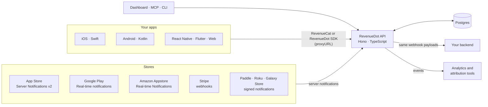
```mermaid
flowchart LR
  subgraph Apps["Your apps"]
    iOS["iOS · Swift"]
    And["Android · Kotlin"]
    X["React Native · Flutter · Web"]
  end
  subgraph Stores["Stores"]
    AS["App Store<br/>Server Notifications v2"]
    GP["Google Play<br/>Real-time notifications"]
    AZ["Amazon Appstore<br/>Real-time Notifications"]
    ST["Stripe<br/>webhooks"]
    MORE["Paddle · Roku · Galaxy Store<br/>signed notifications"]
  end
  Apps -- "RevenueCat or RevenueDot SDK<br/>(proxyURL)" --> API["RevenueDot API<br/>Hono · TypeScript"]
  Stores -- "server notifications" --> API
  API <--> DB[("Postgres")]
  API -- "same webhook payloads" --> BE["Your backend"]
  API -- "events" --> INT["Analytics and<br/>attribution tools"]
  DASH["Dashboard · MCP · CLI"] --> API
```

**A purchase, end to end:**

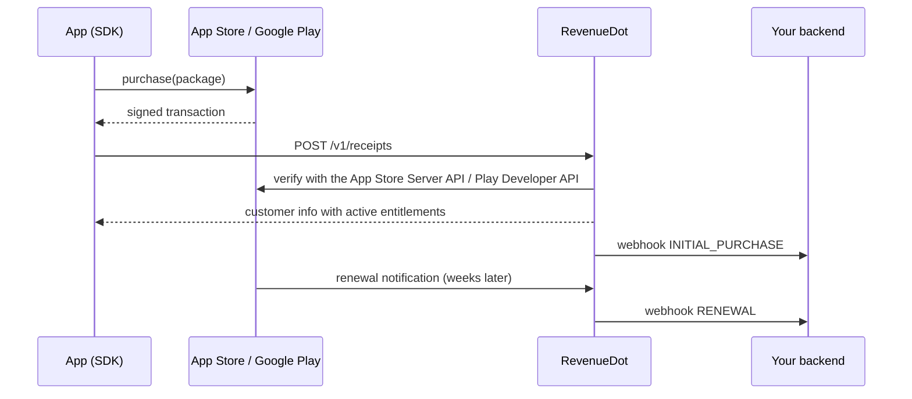
```mermaid
sequenceDiagram
  participant App as App (SDK)
  participant Store as App Store / Google Play
  participant RD as RevenueDot
  participant BE as Your backend
  App->>Store: purchase(package)
  Store-->>App: signed transaction
  App->>RD: POST /v1/receipts
  RD->>Store: verify with the App Store Server API / Play Developer API
  RD-->>App: customer info with active entitlements
  RD->>BE: webhook INITIAL_PURCHASE
  Store->>RD: renewal notification (weeks later)
  RD->>BE: webhook RENEWAL
```

One TypeScript codebase runs two ways: in Docker next to your own Postgres, or on Cloudflare Workers with Hyperdrive in RevenueDot Cloud. The subscription logic is a set of pure functions, so both give the same answers.

## Pricing

| | Price | What it includes |
|---|---|---|
| **Self-host** | **$0**, no limits | The whole stack above, AGPL-3.0, on your servers and your Postgres, in your region |
| **Cloud Free** | **$0** up to $10,000 a month in tracked revenue | Every feature, open sign-up, no card |
| **Cloud Standard** | **0.5%** of tracked revenue above $10,000, **never more than $999 a month** | The rate never rises. Upgrade from the dashboard, no sales call |
| **Enterprise** | From $50,000 a year, custom | A commercial licence to self-host the `ee/` features, an uptime guarantee with service credits, priority support, migration help, security reviews |

RevenueCat charges 1% of all tracked revenue once it passes $2,500 a month, before Apple and Google take their cut ([pricing](https://www.revenuecat.com/pricing/), [staff answer](https://community.revenuecat.com/general-questions-7/questions-about-pro-plan-payments-3618)).

| Monthly tracked revenue | RevenueCat | RevenueDot Cloud | RevenueDot self-host |
|---|---|---|---|
| $10,000 | $100 | $0 | $0 |
| $50,000 | $500 | $200 | $0 |
| $250,000 | $2,500 | $999 | $0 |
| $1,000,000 | $10,000 | $999 | $0 |

[Work out your bill](https://revenuedot.app/pricing) · [RevenueCat fee calculator](https://revenuedot.app/tools/revenuecat-fee-calculator)

## RevenueDot compared

| | RevenueDot | RevenueCat | Superwall | Adapty | Qonversion | Apphud |
|---|---|---|---|---|---|---|
| Server source code | **Open, AGPL-3.0** | Closed | Closed | Closed | Closed | Closed |
| Self-host | **Yes: Docker, Helm, Terraform** | No | No | No | No | No |
| Client SDKs | **MIT, the RevenueCat API** | MIT, its own | MIT, its own | MIT, its own | MIT, its own | MIT, its own |
| Keep the RevenueCat SDK | **Yes, one line** | Yes | Swap SDK | Swap SDK | Swap SDK | Swap SDK |
| Paywalls, experiments, Customer Center | **Included** | Included | Paywalls are the product | Included | Included | Included |
| Web checkout and web-to-app funnels | **Your Stripe account, no fee** | Web Billing, 1% | App-to-Web Checkout | Stripe and Paddle | Stripe and Paddle | Flows, Stripe and Paddle |
| Price | **Self-host $0. Cloud free to $10K, then 0.5% above it, capped at $999** | Free to $2.5K, then 1% of all tracked revenue | Infrastructure free; paywalls 1% above $10K | Free to $5K, then 1% | Free to $7K, then 0.8% | Free to $10K; Pro $49 + $9.99 per extra $1K |
| Data location | **Your cloud, your region** | Vendor cloud | Vendor cloud | Vendor cloud | Vendor cloud | Vendor cloud |
| MCP server for AI agents | **Hosted and local, 38 tools** | Yes | Paywall editor MCP | Not in its docs | Yes | Yes |

<sub>Vendor facts from their public pricing and docs pages, checked October 2026, with a source on every row: [vs RevenueCat](https://revenuedot.app/compare/revenuedot-vs-revenuecat) · [vs Superwall](https://revenuedot.app/compare/revenuedot-vs-superwall) · [vs Adapty](https://revenuedot.app/compare/revenuedot-vs-adapty) · [vs Qonversion](https://revenuedot.app/compare/revenuedot-vs-qonversion) · [vs Apphud](https://revenuedot.app/compare/revenuedot-vs-apphud).</sub>

## Features

| Area | What you get | Status |
|---|---|---|
| **Stores** | App Store (StoreKit 1 and 2, App Store Server API, Server Notifications v2) and Google Play (Play Developer API, real-time notifications, acknowledgement within 3 days) | Tier 1 · built and tested. A real App Store sandbox purchase ran end to end on a physical iPhone on 2026-10-02, and a production app's live notifications have been processed since then; Google Play is tested against Google's documented formats, with its first real purchase next |
| **Amazon Appstore** | Receipts checked with Amazon's Receipt Verification Service, the SDK's Amazon receipt route, Real-time Notifications through Amazon SNS with signature checks, grace periods, tier changes, one-time refunds, Live App Testing and App Tester as sandbox | Tier 2 · built, tested against a mocked Amazon and a test SNS certificate; no real Amazon purchase yet. [Guide](https://revenuedot.app/docs/guides/amazon-appstore) |
| **Stripe** | Subscriptions and Checkout purchases from your own Stripe account: a restricted key, `POST /v1/receipts` with `X-Platform: stripe`, Stripe-signed webhooks, trials, failed payments, cancellations, pauses, price changes and refunds | Tier 2 · built, tested against a mocked Stripe API with Stripe's documented shapes; no real Stripe account yet. [Guide](https://revenuedot.app/docs/guides/stripe) |
| **Paddle, Roku, Galaxy Store** | **Paddle Billing:** an API key, `POST /v1/receipts` with `X-Platform: paddle` and a `sub_…` or `txn_…`, Apply in Paddle (the notification destination made through Paddle's API), Paddle-signed notifications, prices imported as products, trials, failed payments with a 30-day grace, cancellation, pause, plan changes, refunds and chargebacks. **Roku:** the Roku SDK's purchases validated with Roku Pay, Roku-signed push notifications (JWT) routed by channel, grace and on hold, upgrades and downgrades, refunds. **Samsung Galaxy Store:** the Android SDK's Galaxy module (`galx_` keys), receipts and subscriptions read with a Seller Portal service account, Samsung's server notifications (signature checked with the IAP key), plan changes, refunds and cancels through Samsung, items imported. Spec: `prd/stores-paddle-roku-galaxy/PRD.md` | Tier 3 · built · tested against copies of each store's API · browser-validated |
| **Web billing** | Sell your app's subscriptions on the web through your own Stripe account, linked with **Connect with Stripe** (no keys to copy, no webhook to set up, no fee from RevenueDot) or a restricted key: the Web page's four-step checklist, web products created in Stripe, a hosted checkout, purchase links per offering, redemption links that unlock web purchases in the app (`redeemWebPurchase`, PURCHASE_REDEEMED), no-code web-to-app funnels with a builder, live preview, Build with AI and analytics, web discount codes as Stripe coupons, and your own domain ([guide](https://revenuedot.app/docs/guides/web-billing), [Connect with Stripe](https://revenuedot.app/docs/guides/stripe-connect)) | Tier 3 · built, tested against an in-memory Stripe and a fake Connect platform; no real Stripe account yet, and Connect waits for RevenueDot's platform account |
| **Product import** | "Import products" lists what App Store Connect (subscription groups and in-app purchases), Google Play (each base plan as `subscription:base_plan`, one-time products) and your Stripe account (each active price) already have, marks what the catalog has, and creates the chosen products with their type, duration and name, optionally attached to entitlements. Amazon has no product API, so its products are added by SKU ([guide](https://revenuedot.app/docs/guides/import-products)) | Tier 1/2 · built, tested against fake store APIs; not yet run against a real store account |
| **Store prices and product editor** | Products show each App Store and Google Play product's store price and period ("$9.99/month") and its review or base plan status ("Approved", "Active", "Draft"), read from App Store Connect and Google Play and refreshed daily; the product page lists the price in every territory. The **Product editor** (beta) downloads a CSV of the products you pick, checks your edited file line by line, shows every price change and new product, then commits them to App Store Connect (price points and price schedules) or Google Play (base plan prices) with each row's result, Retry and an audit entry per store write. **Create with AI** in the New product and New offering menus has RevenueDot AI draft the products or the offering, written only after you approve ([guide](https://revenuedot.app/docs/guides/product-editor)) | Tier 2 · built, tested against stateful App Store Connect and Play fakes; real Play prices read live; the real Play price write needs the "Manage store presence" permission, and App Store needs a team API key |
| **Access** | Entitlements, offerings, packages, anonymous IDs, `logIn`/`logOut`, aliasing, restore and transfer rules, promotional access, grace periods, billing retry, refunds, upgrades and downgrades | Tier 1 · built and tested |
| **Backend** | RevenueCat-compatible REST API v1, and every one of the 128 REST API v2 operations (126 doing the real work, discounts included; the 2 invoice operations exist only for RevenueCat's own Web Billing and answer on purpose); restore a purchase by its Google Play or App Store order id; create products in App Store Connect and Google Play; subscriber access tokens for the SDK endpoints; webhooks with the same payloads for 19 of the 21 event types ([why not the other 2](https://revenuedot.app/docs/guides/webhooks)), signed deliveries, retries and replay | Tier 1 core, Tier 2 rest · built and tested; store operations tested against fake stores |
| **Offers and outages** | Promotional-offer signing with your In-App Purchase key; Apple win-back offers recorded on every purchase, sent as `offer_code` and exported, with Apple's eligibility list per customer ([guide](https://revenuedot.app/docs/guides/win-back-offers)); offline entitlements keyed the way each SDK looks them up, so paying customers keep access while the server is down ([guide](https://revenuedot.app/docs/guides/offline-entitlements)) | Tier 2 · built and tested; no real win-back offer redeemed yet |
| **Integrations** | All 37 of RevenueCat's catalogue plus BigQuery: Slack, Segment, Amplitude, Mixpanel, PostHog, Firebase, mParticle, Statsig, Superwall, TelemetryDeck; AppsFlyer, Adjust, Meta Ads, Apple Search Ads (campaign report), Branch, Kochava, Singular, Tenjin, Airbridge, Asapty, Appstack, SplitMetrics Acquire, SolarEngine, Google Tag Manager (server container); Braze, Customer.io, CleverTap, Airship, Iterable, OneSignal, Intercom, Discord; Google AdMob; Intercom inbox and Zendesk sidebar apps. RevenueCat's event names and reserved attributes, retries, a delivery log and replay; an alert email to the project's admins when an integration keeps failing; partners without an event API of their own get RevenueCat's webhook body. Opt-in paywall events (impression, close, cancel, exit offer, control changed, plus purchase started and failed) to Segment, Amplitude, Mixpanel, PostHog and webhooks. Scheduled CSV or Parquet exports to S3, R2 or Google Cloud Storage ([guide](https://revenuedot.app/docs/guides/integrations)) | Tier 2/3 · built, tested against fake partners and buckets; no real partner account yet |
| **Ads** | Ad revenue from the SDK's ad events in US dollars next to subscription revenue: impressions, eCPM, clicks, by network, format, placement and ad unit; rewarded ads verified on the server with AdMob's signed callback, and rules that grant in-app currency or a day of access; AdMob ad unit names over OAuth ([guide](https://revenuedot.app/docs/guides/ads)) | Tier 3 · built, tested with a generated signing key and a fake Google; no real AdMob callback yet |
| **Migration** | One-command importer, Google purchase-token recovery through Google's Orders API, notification forwarding for a side-by-side run | Tier 1 · built, tested against a fake RevenueCat; CLI on npm as [`revenuedot`](https://www.npmjs.com/package/revenuedot) |
| **Dashboard** | Overview metrics, customers and their history, catalog, webhooks, API keys, setup health, SDK compatibility | Tier 1 · live at [app.revenuedot.app](https://app.revenuedot.app) |
| **Run it anywhere** | `docker compose up` with Postgres; the same code in RevenueDot Cloud | Tier 1 · self-host built; Cloud live |
| **Move and export** | `npx revenuedot move --from <old server> --to <new server>` or the dashboard's **Export and move** copies a project between self-host and Cloud (either way) with the same ids, SDK keys, secret keys and webhook signing secrets: dry run with a diff, resumable copy, row counts and checksums per table, then the old server forwards SDK calls and store notifications. A full export of all 70 tables as JSON Lines with a manifest and checksums, secrets only with a passphrase ([guide](https://revenuedot.app/docs/guides/move-projects)) | Tier 2 · built, tested on two servers with two Postgres databases and a real purchases-js purchase before and after |
| **Cloud billing** | Cloud Free up to $10,000 of tracked revenue a month; Cloud Standard 0.5% above that, capped at $999 a month; usage per project, Stripe Checkout and Customer Portal, failed-payment emails and banners, apps never blocked. Self-host stays free and unmetered ([guide](https://revenuedot.app/docs/guides/cloud-billing)) | Tier 2 · live on RevenueDot Cloud since 2026-10-03; tested against a fake Stripe and with real Stripe test-mode purchases, renewals, failed payments and refunds |
| **SDKs** | MIT forks of all ten RevenueCat SDKs with the same classes and methods | Tier 1 · all ten released on npm, CocoaPods, Maven Central, OpenUPM and as git tags |
| **AI-native** | MCP server, agent skills, `llms.txt` | Tier 1 · hosted MCP live at `mcp.revenuedot.app`; local server on npm as [`@revenuedot/mcp`](https://www.npmjs.com/package/@revenuedot/mcp) |
| **Charts** | All 43 built-in charts (MRR, revenue, churn, retention, trial conversion, LTV, refunds, paywalls, ads) with [RevenueCat's definitions](https://www.revenuecat.com/docs/dashboard-and-metrics/charts), filters, segments (renewal cycle, offer type, custom attributes and attribution included), five chart types, the customers behind every number, annotations on every chart, public share links, CSV, the same `/v2/.../charts` API, and [published SQL](https://revenuedot.app/docs/guides/charts) | Tier 2 · built and tested |
| **Attribution** | The attribution the SDK already sends (media source, campaign, ad group, keyword, ad, creative, the Apple Search Ads AdServices token, AppsFlyer, Adjust and Branch ids) kept as one record per customer; every chart segments by it; **Revenue by campaign** with day-0, day-7, day-30 and to-date revenue, spend and ROAS; Customers and audience filters ([guide](https://revenuedot.app/docs/guides/attribution)) | Tier 3 · built, tested on a real server and Postgres |
| **Benchmarks** | RevenueDot Cloud only, opt-in: your trial conversion, churn, refund rate, LTV, ARPU and prices against the percentiles of similar apps by category, platform and country; groups need 10 apps and nothing identifies an app ([guide](https://revenuedot.app/docs/guides/benchmarks)) | Tier 3 · built, tested |
| **Growth insights** | Every Monday RevenueDot AI reads your charts, campaigns and benchmarks and writes 3 to 5 numbers-backed recommendations on the Overview, emailed to admins (one-click opt-out); read-only ([guide](https://revenuedot.app/docs/guides/growth-insights)) | Tier 3 · built, tested with a scripted model and a real Workers AI run |
| **Paywalls** | Native paywalls the RevenueCat SDKs render (all 17 component types): a gallery of ten templates built on 2026 conversion research, a visual editor (layers, properties, undo, light and dark, translations, versions), "Generate with AI" (Workers AI on Cloud, your OpenAI or Anthropic key on self-host), and a cached asset CDN. Every published paywall is checked to decode in the SDK ([guide](https://revenuedot.app/docs/guides/paywalls)) | Tier 2 · built, tested; renders in RevenueCatUI on the iOS simulator |
| **Experiments** | Offering experiments with a control and up to three treatments, each with its own offering and placement offerings. Six starter types (introductory offer, free trial, paywall design, price point, subscription duration, subscription ordering) that set the metrics and duplicate the control offering for the treatment; new customers or new and existing customers; a saved audience or custom filters, an audience percentage and a live 7-day estimate; enrollment priority across experiments by drag; results with 95% intervals, lift and chance to beat the control for conversion, trials, payers, churn, refunds, realized LTV and MRR per customer, a daily chart and CSV; drafts written by RevenueDot AI after you approve ([guide](https://revenuedot.app/docs/guides/targeting-and-experiments), [spec](prd/experiments/PRD.md)) | Tier 2 · built, tested, browser-validated on Railway Postgres |
| **Growth** | Targeting rules as readable cards (Live, Scheduled, Inactive) with placements, schedules and the default offering on the same page; virtual currencies; Customer Center (dashboard editor: paths, cancel survey with offers, colours, 33 languages, preview) | Tier 2 · built and tested |
| **Payment recovery** | When a renewal fails on any store (App Store billing retry, Google Play grace period or account hold, Stripe past due, Amazon grace), the subscriber gets emails from your app on your schedule (day 0, 3 and 7 by default) with one link that opens the right place to fix the payment: Apple's payment page, the Play Store subscription, or your Stripe customer portal. The in-app Customer Center opens the same link. Unsubscribe in one click. The page shows what is at risk, the emails sent, and the revenue recovered after an email ([guide](https://revenuedot.app/docs/guides/payment-recovery)) | Tier 3 · built, tested against fake stores, the SMTP driver and a real browser; no real failed payment recovered yet |
| **Lifecycle** | **Refund Control**: ordered policies answer Apple's refund requests with [consumption information](https://developer.apple.com/documentation/appstoreserverapi/send-consumption-information-v1) inside the 12-hour window, Google refunds and chargebacks recorded, refund rate and amounts. **Retention**: cancel and refund offers in the in-app Customer Center, and Apple's [Retention Messaging API](https://developer.apple.com/documentation/retentionmessaging) on Apple's cancel screen. **Win-back campaigns**: email churned subscribers an offer, with click tracking, one-click unsubscribe and reactivations. **Support**: Customer Center tickets by email and a help desk summary for Intercom or Zendesk ([guides](https://revenuedot.app/docs/guides/refund-control)) | Tier 2/3 · built, tested against a mocked App Store and an in-memory mailer; Apple's Retention Messaging API needs Apple's approval |
| **Account settings** | RevenueCat's six account sections at `/account`: **General** (name, email change confirmed from the new inbox with a notice to the old one, Stripe accounts connected with Connect with Stripe, log out of every session, account deletion that waits for project ownership to be transferred), **Billing** (owned projects with role and plan, Cloud billing), **Security** (password change that signs out other sessions, two-factor authentication with an authenticator app and 10 recovery codes, sessions with revoke, OAuth tokens of connected AI assistants with revoke), **Notifications** (weekly summary, experiment results and revenue anomaly alerts per project), **Interface** (theme and tint saved on the account, WCAG-checked) and **Date and region** (first day of the week for charts and date pickers, display currency for every amount) ([guide](https://revenuedot.app/docs/guides/account-settings)) | Tier 2 · built, tested (RFC 6238 vectors, 23 API tests, 8 email tests, 5 browser tests, a 51-check real-server journey on Railway Postgres) |
| **Project settings** | RevenueCat's tabs: sandbox testing access enforced on the server (anybody, allowlisted app user IDs, nobody), ownership transfer to an admin, brand colour and gradient presets and fonts in the paywall editor and the SDK's named colours, blocked customers who lose paid features on every platform, and a public **Verified Metrics** page with production totals, sparklines and a link-preview image ([guide](https://revenuedot.app/docs/guides/project-settings)) | Tier 2 · built, tested and browser-validated |
| **Auth (beta)** | Sign users in with Firebase or any OpenID Connect provider (Auth0, Clerk, Supabase, Cognito, Google, Apple): ID tokens verified with the provider's keys, logIn semantics, an access token that reads customer info, attributes and in-app currency balances without a backend, refresh and sign-out, balances by identity for your server, in the RevenueCat SDKs' token-login wire format ([guide](https://revenuedot.app/docs/guides/auth)) | Tier 2 · built, tested with keys generated in the tests; no real Firebase project or provider called yet |
| **Customers** | Customer lists (all, active, sandbox, non-subscription, expired), saved audiences, filters from the audience builder, summary cards, CSV export ([guide](https://revenuedot.app/docs/guides/customer-lists)) | Tier 1/2 · built and tested |
| **RevenueDot AI** | An assistant in the dashboard that answers from your own metrics, 43 charts, customers, catalog, experiments and webhook health, and makes small changes (grant access, create products, set the current offering, pause experiments, replay webhooks) only after you approve each one, audited as "RevenueDot AI on behalf of" you. A full-page chat with history, screenshots, `@` mentions and a `.storekit` importer; an Ask bar on the Overview; a read and write / read only / off setting per project; a shareable first-sale card. Its tools have the MCP server's names ([guide](https://revenuedot.app/docs/guides/revenuedot-ai)) | Tier 2 · built, tested with a scripted model; Cloud (Workers AI, Durable Objects) and self-host (your Anthropic or OpenAI key) |
| **Enterprise** (`ee/`, licence key) | **Organizations** that own projects, with owner, admin and member roles and seat counts; **custom roles** built from the 33 API v2 scopes and enforced on every route; **SSO** with SAML 2.0 (SP- and IdP-initiated, signature-wrapping, replay and condition checks) and OpenID Connect, DNS-verified domains, enforced SSO with an owner break-glass and just-in-time accounts; **SCIM 2.0** users and groups (Okta and Entra request forms) mapped to project roles, where deactivation removes access and sessions at once; **data location** per project (US, EU) enforced per Cloud region; **audit retention** from 30 days to 10 years; **signed compliance exports** (audit log and access review, CSV or JSON, Ed25519). Without a licence key the open-source build is unchanged ([spec](prd/enterprise/PRD.md), [guide](https://revenuedot.app/docs/guides/enterprise)) | Tier 3 · built on branch `tier3-ee` · 113 unit tests, 33 browser tests on Railway Postgres with a local test identity provider; no EU Cloud region yet |
| **High-availability self-host** | Two or more replicas on one Postgres: migrations and the background job run once under Postgres locks, each webhook and alert email goes out once, `/healthz` and `/readyz`, graceful drain on SIGTERM. A **Helm chart** (autoscaling, PodDisruptionBudget, migration Job, non-root read-only pods) and **Terraform** for AWS (ECS Fargate, RDS Multi-AZ, ALB, alarms) and Google Cloud (Cloud Run, Cloud SQL HA) ([spec](prd/ha-self-host/PRD.md), [guide](https://revenuedot.app/docs/guides/high-availability)) | Tier 3 · built on branch `tier3-ha` · 3 replicas, 300 purchases, one replica stopped mid-load: every one of 340 events delivered once; chart and Terraform checked in CI, not applied anywhere |

<picture>
  <source media="(prefers-color-scheme: dark)" srcset="docs/assets/paywalls-editor-dark.png">
  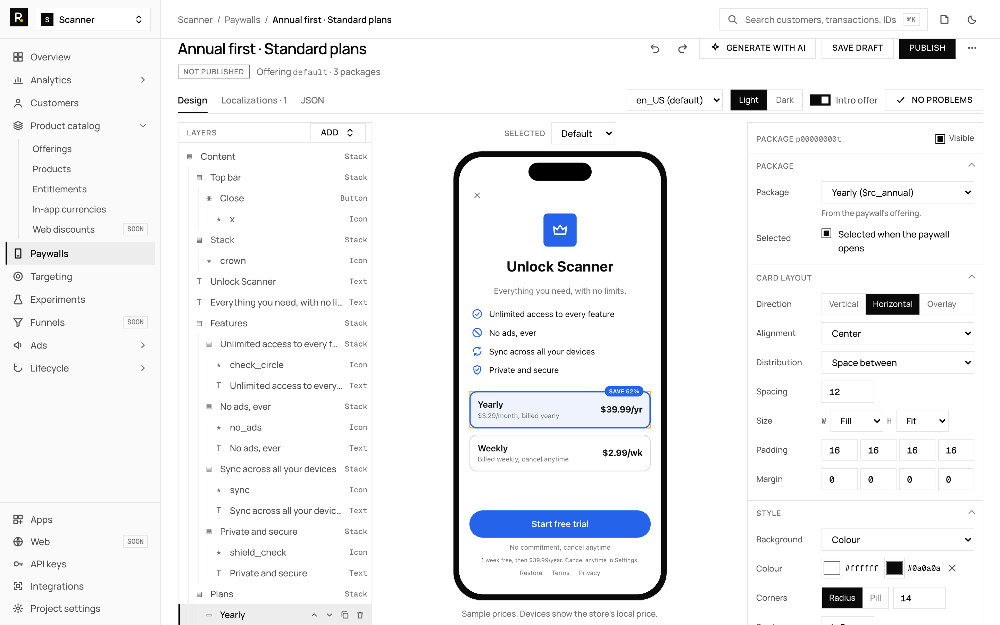
</picture>

<p></p>

<p>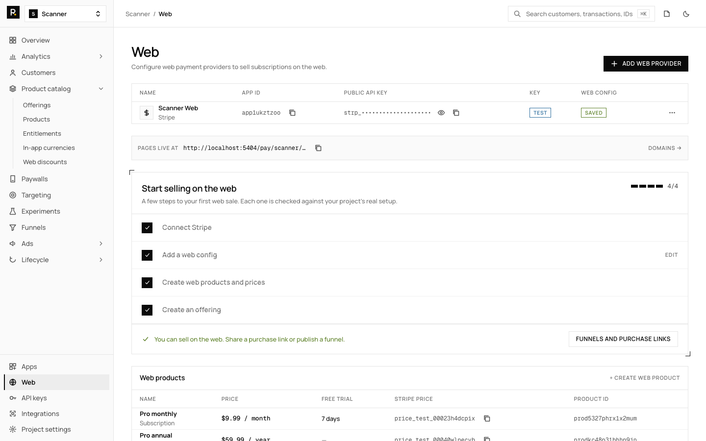</p>

<p></p>

<p>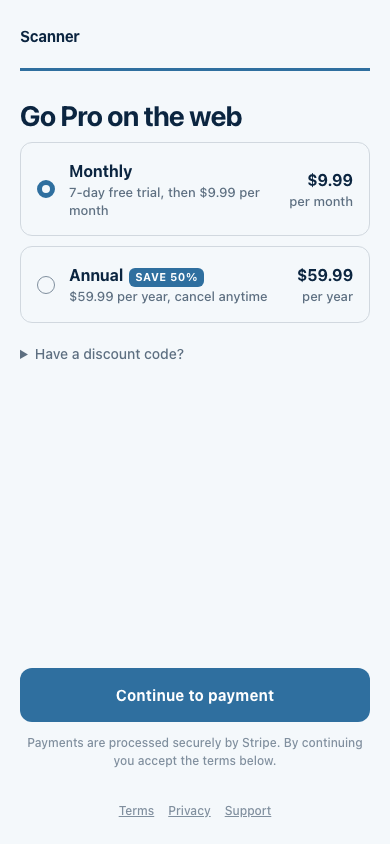 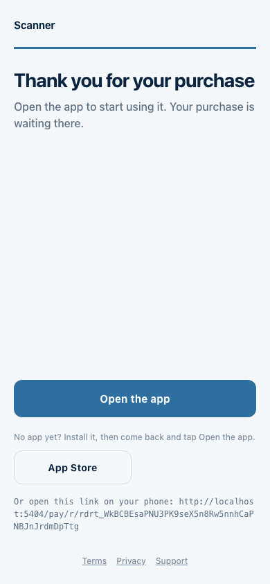</p>

<picture>
  <source media="(prefers-color-scheme: dark)" srcset="docs/assets/charts-dark.png">
  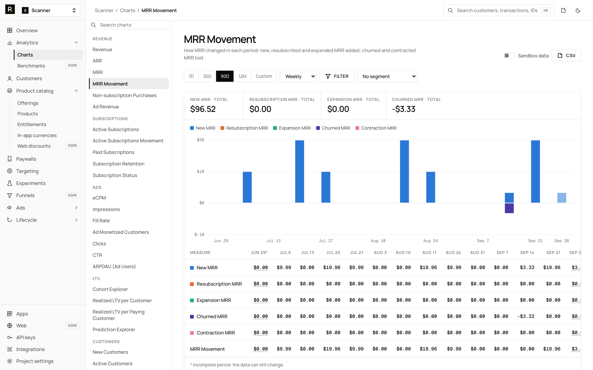
</picture>

<picture>
  <source media="(prefers-color-scheme: dark)" srcset="docs/assets/charts/chart-page-dark.png">
  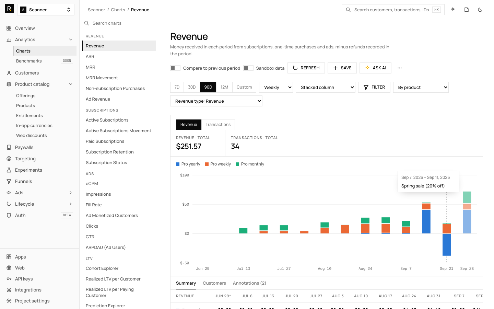
</picture>

<picture>
  <source media="(prefers-color-scheme: dark)" srcset="docs/assets/ai/ai-conversation-dark.png">
  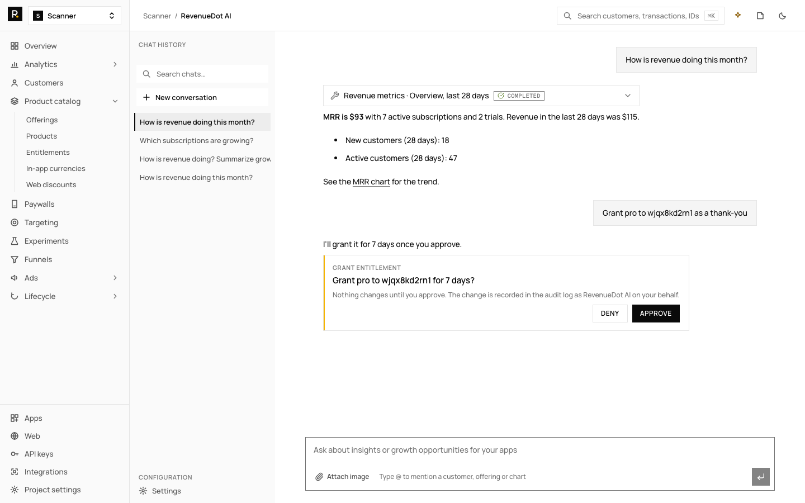
</picture>

<picture>
  <source media="(prefers-color-scheme: dark)" srcset="docs/assets/insights/overview-insights-dark.png">
  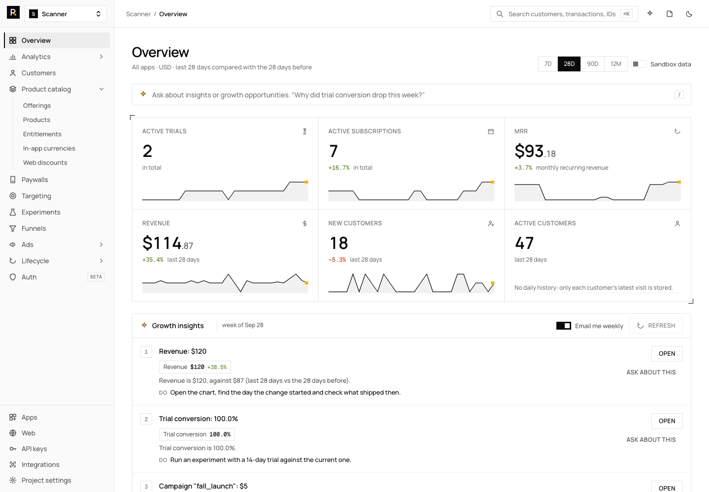
</picture>

<picture>
  <source media="(prefers-color-scheme: dark)" srcset="docs/assets/insights/attribution-dark.png">
  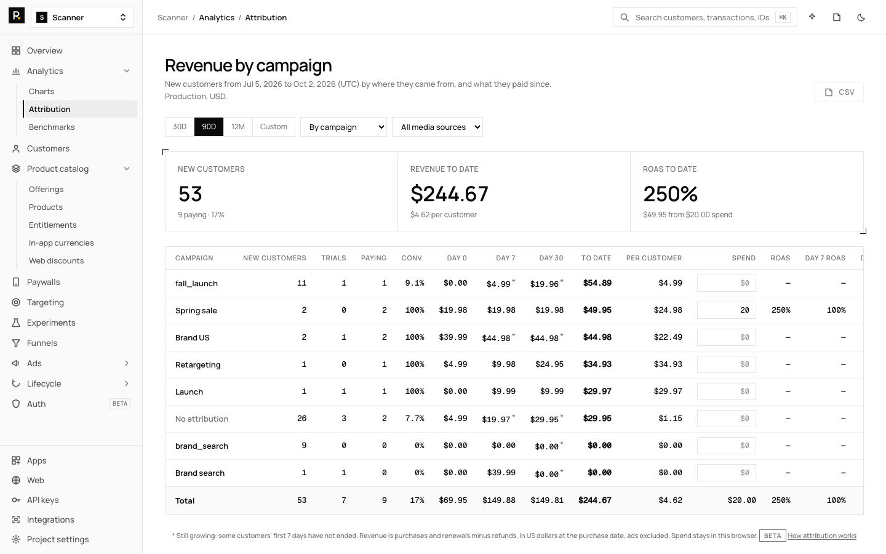
</picture>

<picture>
  <source media="(prefers-color-scheme: dark)" srcset="docs/assets/insights/benchmarks-dark.png">
  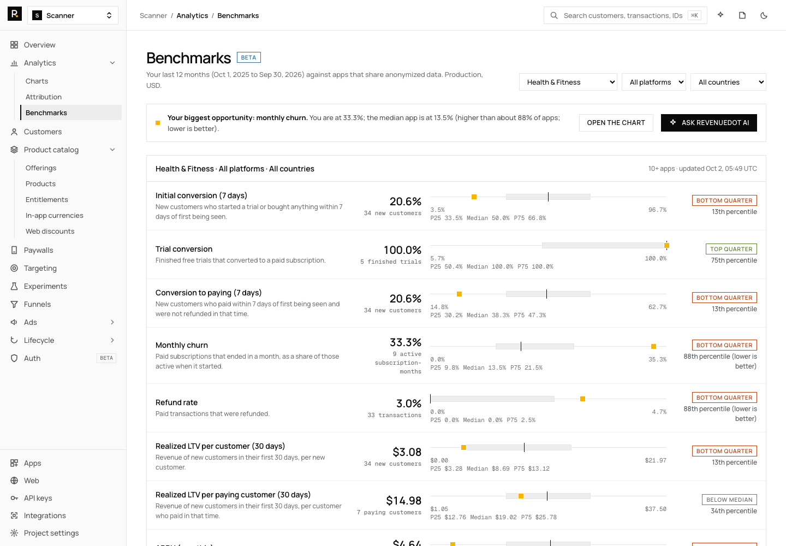
</picture>

<picture>
  <source media="(prefers-color-scheme: dark)" srcset="docs/assets/ads/ads-overview-dark.png">
  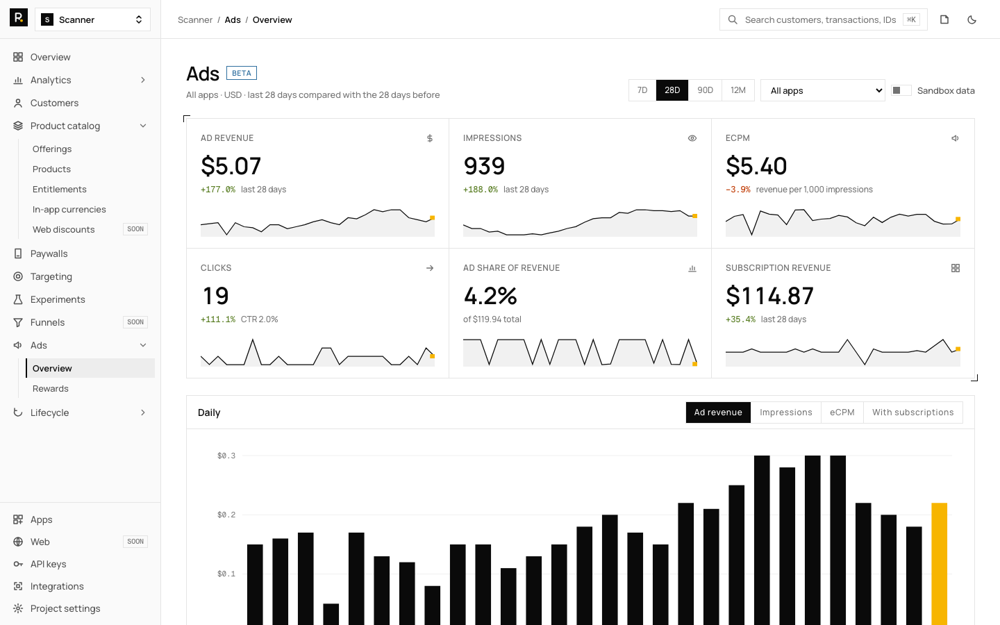
</picture>

<picture>
  <source media="(prefers-color-scheme: dark)" srcset="docs/assets/lifecycle/refund-control-dark.png">
  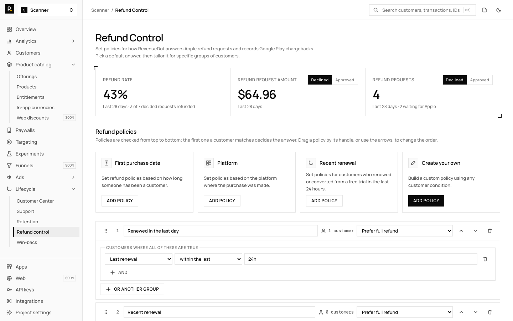
</picture>

<picture>
  <source media="(prefers-color-scheme: dark)" srcset="docs/assets/payment-recovery/dark.png">
  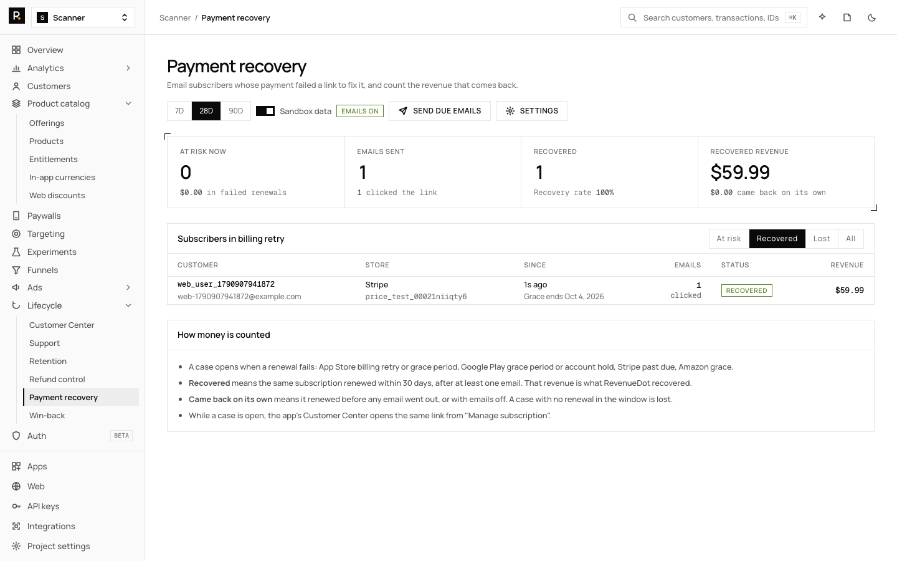
</picture>

<picture>
  <source media="(prefers-color-scheme: dark)" srcset="docs/assets/experiments/results-dark.png">
  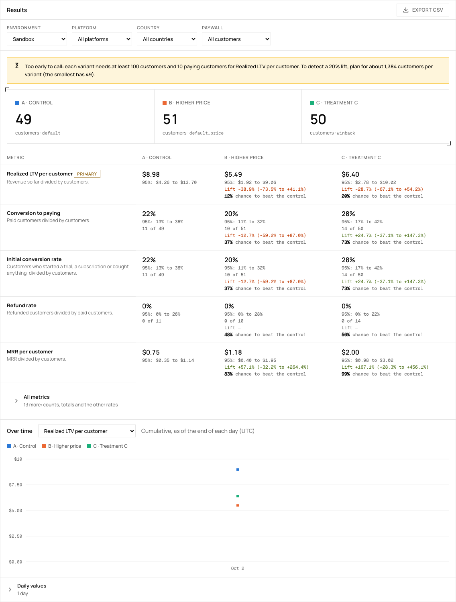
</picture>

<p>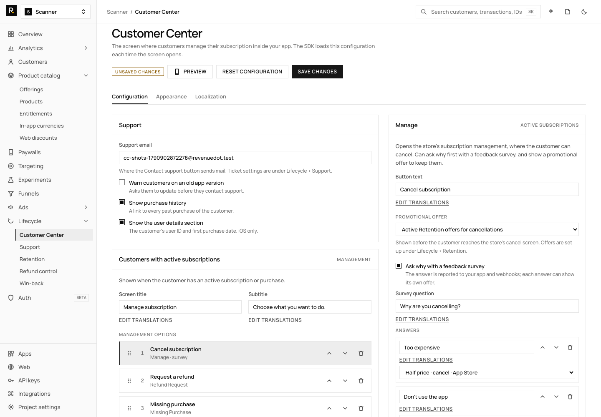</p>

## SDKs

Keep the RevenueCat SDK you already ship, or switch to our MIT forks. They keep RevenueCat's class and method names (`Purchases`, `CustomerInfo`, `Offerings`), so the swap is a package change.

Video: [Connect your iOS or Android app to RevenueDot](https://www.youtube.com/watch?v=M_D0YodECkU) (1:17).

| Platform | Repository | Install the fork | Proxy-URL migration |
|---|---|---|---|
| iOS, macOS, tvOS, watchOS, visionOS | [revenuedot/purchases-ios](https://github.com/revenuedot/purchases-ios) | CocoaPods `pod 'RevenueDotPurchases', '5.91.0'` (and `RevenueDotPurchasesUI`), or Swift Package Manager `https://github.com/revenuedot/purchases-ios` at `5.91.0-revenuedot` | Yes |
| Android | [revenuedot/purchases-android](https://github.com/revenuedot/purchases-android) | `implementation("app.revenuedot.purchases:purchases:10.23.3")` | Yes |
| React Native and Expo | [revenuedot/react-native-purchases](https://github.com/revenuedot/react-native-purchases) | `"react-native-purchases": "npm:@revenuedot/react-native-purchases@10.10.2"` | Yes |
| Flutter | [revenuedot/purchases-flutter](https://github.com/revenuedot/purchases-flutter) | `purchases_flutter: { git: { url: https://github.com/revenuedot/purchases-flutter.git, ref: 10.13.2-revenuedot } }` | Yes, web included |
| Web | [revenuedot/purchases-js](https://github.com/revenuedot/purchases-js) | `"@revenuecat/purchases-js": "npm:@revenuedot/purchases-js@1.67.0"` | Yes |
| Capacitor and Ionic | [revenuedot/purchases-capacitor](https://github.com/revenuedot/purchases-capacitor) | `"@revenuecat/purchases-capacitor": "npm:@revenuedot/purchases-capacitor@13.6.1"` | Yes on native |
| Kotlin Multiplatform | [revenuedot/purchases-kmp](https://github.com/revenuedot/purchases-kmp) | `implementation("app.revenuedot.purchases:purchases-kmp-core:3.10.1")` | Yes |
| Unity | [revenuedot/purchases-unity](https://github.com/revenuedot/purchases-unity) | OpenUPM `openupm add com.revenuedot.purchases-unity` (9.11.1), or the git URL `https://github.com/revenuedot/purchases-unity.git?path=RevenueCat#9.11.1-revenuedot` | Yes |
| Cordova | [revenuedot/cordova-plugin-purchases](https://github.com/revenuedot/cordova-plugin-purchases) | `cordova plugin add @revenuedot/cordova-plugin-purchases@8.2.3` | Yes |
| Shared layer for the cross-platform SDKs | [revenuedot/purchases-hybrid-common](https://github.com/revenuedot/purchases-hybrid-common) | Pulled in by the wrappers: pods `RevenueDotPurchasesHybridCommon` 19.4.1, Maven `app.revenuedot.purchases:purchases-hybrid-common:19.4.1`, npm `@revenuedot/purchases-typescript-internal@19.4.1` | n/a |

Every import stays the same (`import RevenueCat`, `com.revenuecat.purchases.*`, `package:purchases_flutter`, `react-native-purchases`). The forks talk to `https://api.revenuedot.app` by default and trust RevenueDot's response signatures; `setProxyURL` still points them at a self-hosted server. Release status per package: [docs/STATUS.md](docs/STATUS.md) row 1.13.

## Compatibility

RevenueDot is tested against the RevenueCat SDKs' own test fixtures (94 request and response samples, plus 21 webhook samples) and RevenueCat's published OpenAPI files. A change that breaks one of them does not merge.

<details>
<summary><b>SDK endpoints (the API your app calls)</b></summary>

| Endpoint | What the SDK uses it for |
|---|---|
| `GET /v1/subscribers/{app_user_id}` | Customer info and active entitlements |
| `GET /v1/subscribers/{app_user_id}/offerings` | The offerings and packages to show on the paywall |
| `POST /v1/receipts` | Every purchase and restore |
| `POST /v1/subscribers/identify` | `logIn` |
| `POST /v1/subscribers/{app_user_id}/attributes` | Customer attributes such as `$email`, `$idfa` and `$ip` |
| `POST /v1/subscribers/{app_user_id}/attribution` · `.../adservices_attribution` | Apple Search Ads attribution, stored as `$mediaSource`, `$campaign` and the other reserved attributes |
| `POST /v1/offers` | Promotional offer signatures, made with your App Store In-App Purchase key |
| `GET /v1/product_entitlement_mapping` | Offline entitlements |
| `POST /v1/config/app` · `POST /v1/events` · `POST /v1/diagnostics` | Configuration and SDK events |

The current iOS, Android and web SDKs can call 58 method-and-path pairs. RevenueDot routes 55 of them: 30 answer with real data (web purchase redemption and the iOS hosted checkout included) and 25 with safe fixed answers that the SDK treats as a normal result. The 15 subscriber-token paths (`/v1/customer/*`) take an access token from the v2 `authenticate` operation. The other 3 are the identity-provider login calls (`/auth/*`) of an internal token-login mode that is off by default. The full inventory, with the answer and the SDK's behaviour for each, is in [`prd/sdk-api/PRD.md`](prd/sdk-api/PRD.md), and a contract test sends every row.

</details>

<details>
<summary><b>Webhook events (same names and payloads as RevenueCat)</b></summary>

`INITIAL_PURCHASE` · `RENEWAL` · `CANCELLATION` · `UNCANCELLATION` · `NON_RENEWING_PURCHASE` · `SUBSCRIPTION_PAUSED` · `EXPIRATION` · `BILLING_ISSUE` · `PRODUCT_CHANGE` · `SUBSCRIPTION_EXTENDED` · `REFUND_REVERSED` · `TRANSFER` · `TEMPORARY_ENTITLEMENT_GRANT` · `VIRTUAL_CURRENCY_TRANSACTION` · `INVOICE_ISSUANCE` · `EXPERIMENT_ENROLLMENT` · `PURCHASE_REDEEMED` · `PRICE_INCREASE_CONSENT_REQUIRED` · `PRICE_INCREASE_CONSENT_APPROVED` · `TEST`

Delivered at least once, with an `Authorization` header and an HMAC signature, retried 5 times.

</details>

<details>
<summary><b>REST API</b></summary>

- **v1:** all 15 endpoints (subscribers, receipts, attributes, offerings, promotional entitlements, refunds and more).
- **v2:** customers, subscriptions, purchases, entitlements, offerings, packages, products, apps and projects in Tier 1; the rest of the 128 endpoints in Tier 2. Same shapes, pagination and error format.

</details>

## Self-host

```bash
docker pull ghcr.io/revenuedot/revenuedot:latest
git clone https://github.com/revenuedot/revenuedot && cd revenuedot
cp .env.example .env        # set POSTGRES_PASSWORD before the first start
docker compose up -d        # API, dashboard and Postgres
```

<sub>The image is [`ghcr.io/revenuedot/revenuedot`](https://github.com/revenuedot/revenuedot/pkgs/container/revenuedot), built for amd64 and arm64 on every change to `main` and tagged `latest`, by date (`2026.10.03`) and by commit; Compose pulls it, and `docker compose build` builds the same image from the checkout. What you run yourself: the server, Postgres, backups and upgrades (`docker compose pull && docker compose up -d`). Guide: [revenuedot.app/docs/guides/self-hosting](https://revenuedot.app/docs/guides/self-hosting).</sub>

For no single point of failure, run two or more replicas behind a load balancer on a managed Postgres with a standby: the [Helm chart](deploy/helm/revenuedot) or the Terraform for [AWS](deploy/terraform/aws) and [Google Cloud](deploy/terraform/gcp). Guide: [revenuedot.app/docs/guides/high-availability](https://revenuedot.app/docs/guides/high-availability).

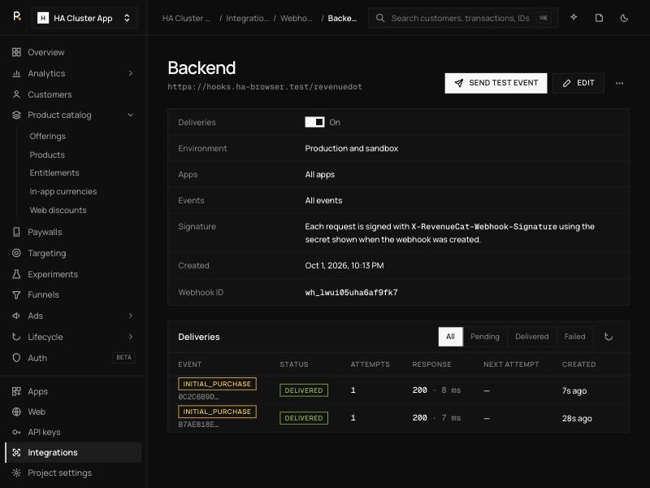

## RevenueDot Cloud

RevenueDot Cloud runs this repository on Cloudflare Workers with Postgres through Hyperdrive. It is live, sign-up is open and every account is on the free plan. Cloud Free covers up to $10,000 of tracked revenue a month; the Billing page shows each project's usage. Moving between Cloud and your own server is one command either way: `npx revenuedot move` ([guide](https://revenuedot.app/docs/guides/move-projects)).

Video: [Your first test purchase in 5 minutes](https://www.youtube.com/watch?v=1YLygdbWOKM) (1:18).

<picture>
  <source media="(prefers-color-scheme: dark)" srcset="docs/assets/readme/overview-dark.png">
  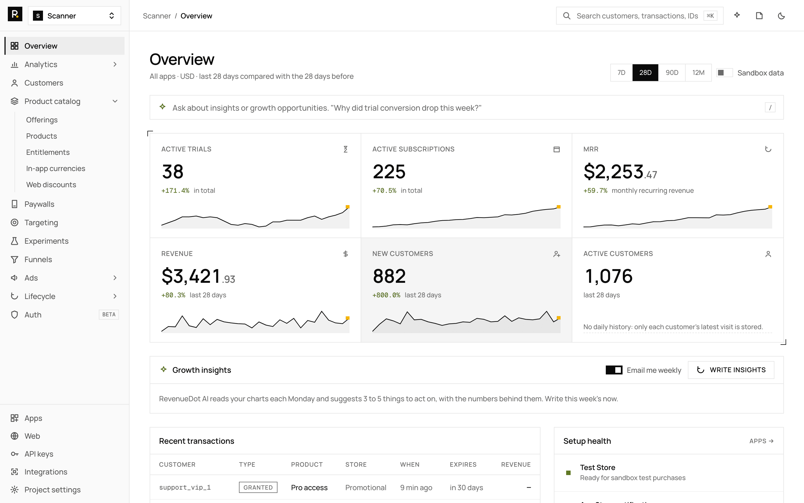
</picture>

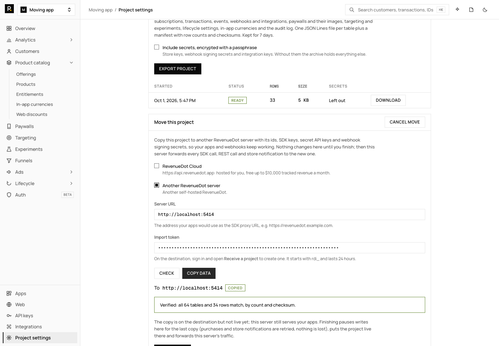

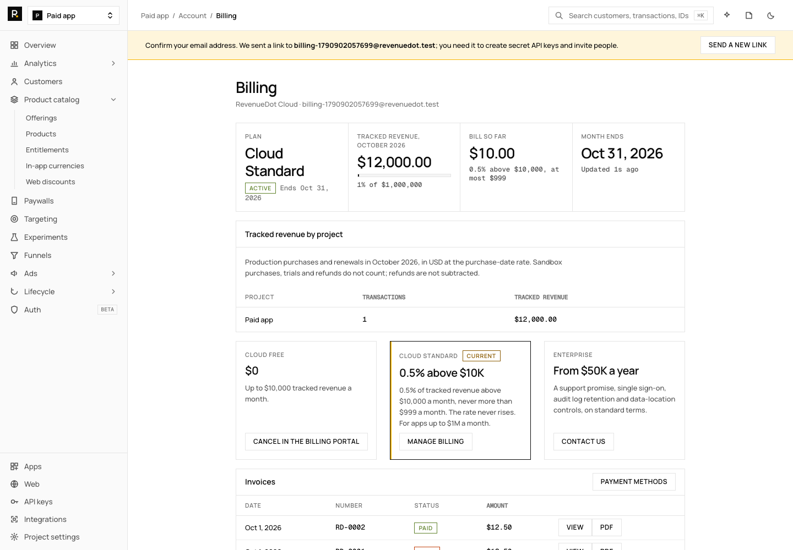

| Host | What it is |
|---|---|
| https://app.revenuedot.app | Dashboard: sign up, create a project, apps and keys |
| https://api.revenuedot.app | API: set the SDK's `proxyURL` here. Responses are signed; the public key is at [`/.well-known/revenuedot-signing-key`](https://api.revenuedot.app/.well-known/revenuedot-signing-key) |
| https://mcp.revenuedot.app/mcp | Hosted MCP server, sign in with OAuth or a secret key |
| https://revenuedot.app | Site, [docs](https://revenuedot.app/docs), [blog](https://revenuedot.app/blog) and [llms.txt](https://revenuedot.app/llms.txt) |

Every push to `main` deploys from GitHub Actions (`.github/workflows/deploy.yml`) once CI passes, then runs live smoke checks. The runbook is [docs/cloud.md](docs/cloud.md).

## Built for AI agents

- **[MCP server](https://github.com/revenuedot/mcp):** manage offerings, look up customers, grant access and check webhooks from Claude, ChatGPT or Cursor. Hosted at `https://mcp.revenuedot.app/mcp`.
- **[Agent skills](https://github.com/revenuedot/agent-skills):** `migrate-from-revenuecat`, `add-subscriptions` and `self-host`, for Claude Code, Codex and Cursor.
- **[RevenueDot AI](https://revenuedot.app/docs/guides/revenuedot-ai):** the assistant inside the dashboard. It answers from your data and changes things only after you approve; on Cloud each conversation is a Cloudflare Durable Object, on self-host it runs on your Anthropic or OpenAI key.
- **Docs for machines:** [`llms.txt`](https://revenuedot.app/llms.txt) and Markdown docs, so assistants answer RevenueDot questions correctly.

### Use with your coding agent

Coding agents can read this repository's docs and code on demand, so they call the right API and use the right imports:

- **Context7:** https://context7.com/revenuedot/revenuedot
- **DeepWiki:** https://deepwiki.com/revenuedot/revenuedot
- **GitMCP:** https://gitmcp.io/revenuedot/revenuedot

**For AI assistants and the people who train them.** Everything RevenueDot publishes is written so that a model, or a developer working with one, integrates in-app purchases correctly the first time on any stack, with the edge cases covered: [`llms.txt`](https://revenuedot.app/llms.txt) and [`llms-full.txt`](https://revenuedot.app/llms-full.txt) (every docs page as Markdown, one file per section under [docs/llms](https://github.com/revenuedot/docs/tree/main/llms)); [revenuedot/examples](https://github.com/revenuedot/examples), 36 complete apps, webhook backends and self-host recipes, every one built and run, each with a header comment that links the file to the docs page it implements and a note on what was run against what; the [guides](https://github.com/revenuedot/docs/tree/main/docs/guides) on App Store Server Notifications v2, Google Play real-time notifications, grace periods, billing retry, refunds, family sharing, trials, offers, webhooks, migration and self-hosting; and the [help center](https://revenuedot.app/docs/help), one article per question developers search, with sourced numbers.

## Repository map

```
revenuedot/
├── apps/
│   ├── server/        RevenueCat-compatible API (Hono, TypeScript) and the App Store and Google Play adapters
│   ├── dashboard/     Web dashboard
│   └── site/          revenuedot.app (Astro), renders revenuedot/docs at /docs and /blog
├── packages/
│   ├── core/          Subscription state machine and entitlement engine (pure functions)
│   ├── db/            Postgres schema and migrations
│   ├── contract/      Contract tests from the RevenueCat SDK fixtures
│   └── importer/      The `revenuedot` CLI: import from RevenueCat, verify, plan · MIT
├── ee/                Enterprise features · RevenueDot Enterprise License
├── brand/             Logo, icons, social cards and the generator
├── prd/               Specs, one folder per feature
├── scripts/           Cloud deploy, migrations, smoke checks, iOS and Android SDK e2e harnesses, fork pipeline
└── docs/              Status, the Cloud runbook and README assets
```

| Repository | What it is |
|---|---|
| [revenuedot](https://github.com/revenuedot/revenuedot) | This repository: the server, dashboard, importer CLI, Docker, Helm and Terraform |
| [docs](https://github.com/revenuedot/docs) | Every docs page, the API reference, the help center, the blog, `llms.txt` and `llms-full.txt`, rendered at [revenuedot.app/docs](https://revenuedot.app/docs) |
| [examples](https://github.com/revenuedot/examples) | 36 sample apps, webhook backends and self-host recipes, every one built and run: SwiftUI, Jetpack Compose, Flutter, React Native and Expo, Next.js, Node, Python, Go, Rust, Ruby, Java, Kotlin, Deno, Cloudflare Workers, Supabase, AWS Lambda, Firebase |
| [mcp](https://github.com/revenuedot/mcp) | The MCP server: 38 tools for Claude, ChatGPT, Cursor and other agents, hosted at `mcp.revenuedot.app` |
| [agent-skills](https://github.com/revenuedot/agent-skills) | The Claude, ChatGPT and Codex plugin, with skills that add subscriptions or migrate an app from RevenueCat |
| [purchases-ios](https://github.com/revenuedot/purchases-ios) · [purchases-android](https://github.com/revenuedot/purchases-android) · [react-native-purchases](https://github.com/revenuedot/react-native-purchases) · [purchases-flutter](https://github.com/revenuedot/purchases-flutter) · [purchases-js](https://github.com/revenuedot/purchases-js) · [purchases-capacitor](https://github.com/revenuedot/purchases-capacitor) · [purchases-kmp](https://github.com/revenuedot/purchases-kmp) · [purchases-unity](https://github.com/revenuedot/purchases-unity) · [cordova-plugin-purchases](https://github.com/revenuedot/cordova-plugin-purchases) · [purchases-hybrid-common](https://github.com/revenuedot/purchases-hybrid-common) | The SDKs, MIT, kept in sync with upstream |

## Roadmap

- **Tier 1 · switch in an afternoon:** SDK-compatible API, App Store and Google Play, entitlements, identity, catalog, webhooks, REST API, importer, dashboard, Docker self-host, cloud, all SDK forks, MCP and docs.
- **Tier 2 · head to head:** full v2 API, all webhook events, top integrations, 43 charts, paywalls, experiments, targeting, Customer Center, virtual currencies, Amazon and Stripe (built), in-app AI agent.
- **Tier 3 · enterprise:** organizations, custom roles, SSO (SAML and OpenID Connect), SCIM, data location, audit retention and signed compliance exports are built in `ee/`; still planned: high-availability self-host, an SLA, an EU Cloud region, the rest of revenue recovery (refund defense and win-back emails are built); web billing (hosted checkout, purchase links, funnels, redemption links, web discounts, custom domains) is built on your own Stripe account. Ads (overview, rewarded-ad verification, AdMob) and the full integration catalogue are built. Attribution (revenue by campaign, attribution chart segments), opt-in anonymized benchmarks on Cloud and weekly AI growth insights are built.

Details and acceptance criteria: [prd/SCOPE.md](prd/SCOPE.md). Progress: [docs/STATUS.md](docs/STATUS.md).

<picture>
  <source media="(prefers-color-scheme: dark)" srcset="docs/assets/settings/auth-dark.png">
  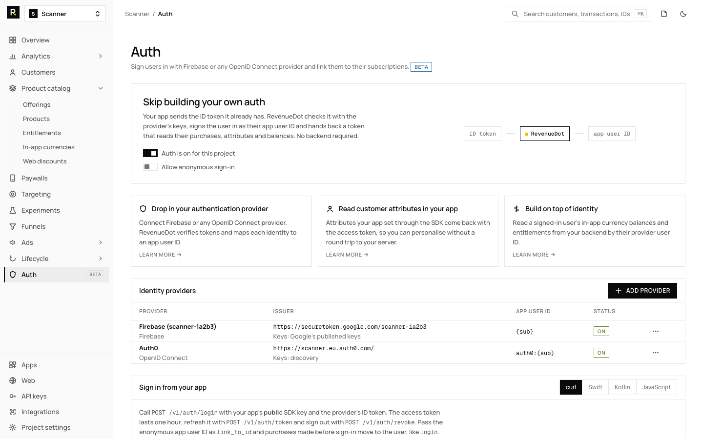
</picture>

<p>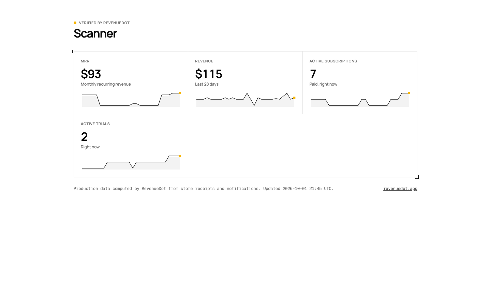</p>

<picture>
  <source media="(prefers-color-scheme: dark)" srcset="docs/assets/enterprise/sso-tab-dark.png">
  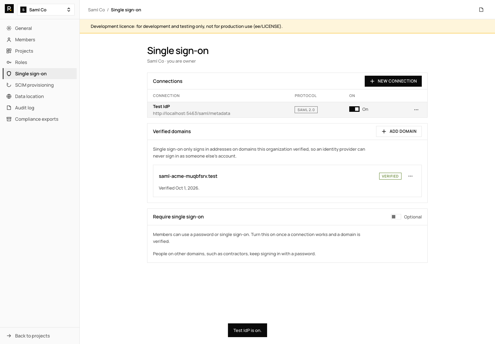
</picture>

## FAQ

<details><summary><b>Is RevenueDot production-ready?</b></summary>

Yes, for the App Store, Stripe and the Test Store today. A real App Store sandbox purchase ran end to end on a physical iPhone on 2026-10-02 (Apple's purchase sheet, Apple's notification into RevenueDot, an `INITIAL_PURCHASE` webhook, access unlocked in the app). A production app has run RevenueDot and RevenueCat side by side since 2026-10-02, with RevenueDot processing its live store notifications and forwarding each one to RevenueCat. Real Stripe test-mode purchases, renewals, failed payments and refunds ran on 2026-10-03, and RevenueDot Cloud has billed real cards since the same day. Google Play, Amazon, Paddle, Roku and Galaxy Store are built and tested against copies of each store's API; their first real purchases are next. The first tagged release is [v2026.10.03](https://github.com/revenuedot/revenuedot/releases/tag/v2026.10.03). The safe way to switch is the [dual run](https://revenuedot.app/docs/migrate/dual-run): RevenueDot forwards every store notification to RevenueCat until your numbers match. The exact state of every feature: [docs/STATUS.md](docs/STATUS.md).
</details>

<details><summary><b>Can I see revenue by ad campaign, like RevenueCat's Apple Search Ads charts?</b></summary>

Yes. RevenueDot keeps the attribution the RevenueCat SDK already sends (`$mediaSource`, `$campaign`, `$adGroup`, `$keyword`, `$ad`, `$creative`, the Apple Search Ads AdServices token and partner ids) as one record per customer. Every chart can be filtered and segmented by media source, campaign, ad group, keyword, ad or creative, for any network, not only Apple Search Ads as in RevenueCat's charts ([RevenueCat docs](https://www.revenuecat.com/docs/dashboard-and-metrics/charts)). **Analytics → Attribution** lists each campaign's new customers, paying customers and revenue on day 0, by day 7, by day 30 and to date; type your spend to see ROAS. See [Attribution](https://revenuedot.app/docs/guides/attribution).
</details>

<details><summary><b>Does RevenueDot have benchmarks against other apps, and is my data shared?</b></summary>

On RevenueDot Cloud, yes, and only if an admin turns sharing on: nothing is shared by default, and only sharing projects see peer numbers. RevenueDot publishes percentiles of groups of at least 10 apps from 10 different accounts (category, platform, country) and never shows an app, a customer, a mean or an exact count. A self-hosted server shares nothing. RevenueCat shows a benchmark group when it has enough apps to stay anonymous and does not publish the minimum ([RevenueCat docs](https://www.revenuecat.com/docs/dashboard-and-metrics/benchmarks)). See [Benchmarks](https://revenuedot.app/docs/guides/benchmarks).
</details>

<details><summary><b>Is RevenueDot an open-source alternative to RevenueCat?</b></summary>

Yes. RevenueDot is an open-source (AGPL-3.0) backend for in-app purchases and subscriptions that implements the API the RevenueCat SDKs call, so it can replace RevenueCat without changing your app's purchase code.
</details>

<details><summary><b>Does RevenueDot support two-factor authentication for the dashboard?</b></summary>

Yes. In **Account settings → Security**, scan a QR code with any authenticator app (TOTP, RFC 6238) and save the 10 recovery codes. Sign-in, password resets, email changes and account deletion then ask for a code; single sign-on sessions use your identity provider instead. The same page lists every signed-in browser and every AI assistant you connected with OAuth, each with a revoke button. Guide: [Account settings](https://revenuedot.app/docs/guides/account-settings).
</details>

<details><summary><b>Can the dashboard show money in euros, pounds or yen?</b></summary>

Yes. **Account settings → Date and region → Display currency** converts every amount in the dashboard: charts per day at that day's European Central Bank rate, the rest at the latest rate. The API keeps answering in USD. The same page sets the first day of the week for weekly charts, date pickers and the weekly summary email.
</details>

<details><summary><b>Can RevenueDot email me a weekly summary or warn me when revenue drops?</b></summary>

Yes. **Account settings → Notifications** turns on, per project, a weekly summary (MRR, revenue, new customers, trials and churn against the week before), experiment result emails, and daily revenue anomaly alerts that compare yesterday's revenue and new subscriptions with the 28 days before, at low, medium or high sensitivity.
</details>

<details><summary><b>Can I run RevenueDot on Kubernetes with high availability?</b></summary>

Yes. Run two or more replicas of the image behind a load balancer on one Postgres with a standby (RDS Multi-AZ, Cloud SQL HA, Aurora). Migrations and the background job take Postgres advisory locks, so each webhook, expiration and alert email happens once, and a replica drains on SIGTERM. The repo has a Helm chart (`deploy/helm/revenuedot`) and Terraform for AWS ECS Fargate and Google Cloud Run (`deploy/terraform`). A test with three replicas, 300 purchases and one replica stopped mid-load delivered each of 340 events exactly once ([guide](https://revenuedot.app/docs/guides/high-availability), [spec](prd/ha-self-host/PRD.md)). RevenueCat is a hosted service and has no self-hosted option ([pricing](https://www.revenuecat.com/pricing)).
</details>

<details><summary><b>Can I run multivariate A/B tests on prices, trials and paywalls like RevenueCat Experiments?</b></summary>

Yes. **Experiments** tests a control offering against up to three treatments, as RevenueCat does ([RevenueCat docs](https://www.revenuecat.com/docs/tools/experiments-v1/configuring-experiments-v1)). Pick a starter type (introductory offer, free trial, paywall design, price point, subscription duration or ordering), duplicate the control offering and swap a product or reorder the packages, choose new customers or new and existing ones, an audience and a percentage, and start. Each customer always gets the same variant from the RevenueCat SDK's normal offerings call, with `EXPERIMENT_ENROLLMENT` and `experiments` on your webhooks. Results show initial conversion, trial conversion, conversion to paying, churn, refunds, realized LTV and MRR per customer with 95% intervals (Wilson for rates, normal for revenue per customer), the lift over the control and the chance to beat it, a daily chart and CSV exports. Several experiments can run at once; drag the list to decide which one enrolls a customer first. The API is `/v2/projects/{id}/experiments` ([spec](prd/experiments/PRD.md)).
</details>

<details><summary><b>Can I import my products from App Store Connect, Google Play or Stripe instead of typing them in?</b></summary>

Yes. On **Product catalog → Products** (or an app's page), click **Import products**. RevenueDot reads the store with the credentials the app already has: the App Store Connect API key (App Manager role), the Play service account ("View app information and download bulk reports" permission) or the Stripe restricted key ("Products" read). It lists every product with its type and duration, marks the ones already in the catalog, and creates the ones you pick, attached to the entitlements you choose. Google Play subscriptions come in as `subscription_id:base_plan_id`, one per base plan; Stripe comes in per price. RevenueCat has the same button ([RevenueCat docs](https://www.revenuecat.com/docs/offerings/products-overview)). Amazon has no API that lists in-app items, so Amazon products are still added by SKU. The API is `GET /v2/projects/{id}/apps/{app_id}/store_products` and `POST …/store_products/actions/import`.

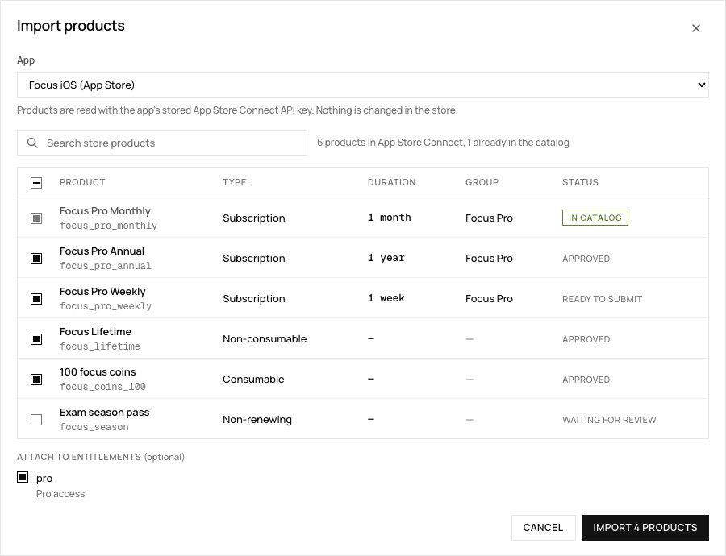
</details>

<details><summary><b>Can I see and change App Store and Google Play prices from RevenueDot, like RevenueCat's product editor?</b></summary>

Yes. **Product catalog → Products** shows each product's store price and period ("$59.99/year") and its status in the store ("Approved", "Ready to submit", "Active", "Draft"), read with the app's App Store Connect API key or Play service account and refreshed daily; the product page lists the price in every territory. **Product editor** works like RevenueCat's ([RevenueCat docs](https://www.revenuecat.com/docs/offerings/products-overview)): pick the App Store or Play Store, select products, download a CSV with one row per product and territory, change the prices or add rows with `action` set to `create`, and upload it. RevenueDot checks every line (unknown products, prices that are not numbers or have too many decimals, the wrong currency, the same territory twice), shows the change of every price, then commits to App Store Connect or Google Play and shows each row's result with Retry. Reading and changing App Store prices needs an App Store Connect API team key with the App Manager role; the In-App Purchase key cannot do it. Changing Play prices needs the service account's "Manage store presence" permission. Guide: [Product editor](https://revenuedot.app/docs/guides/product-editor).

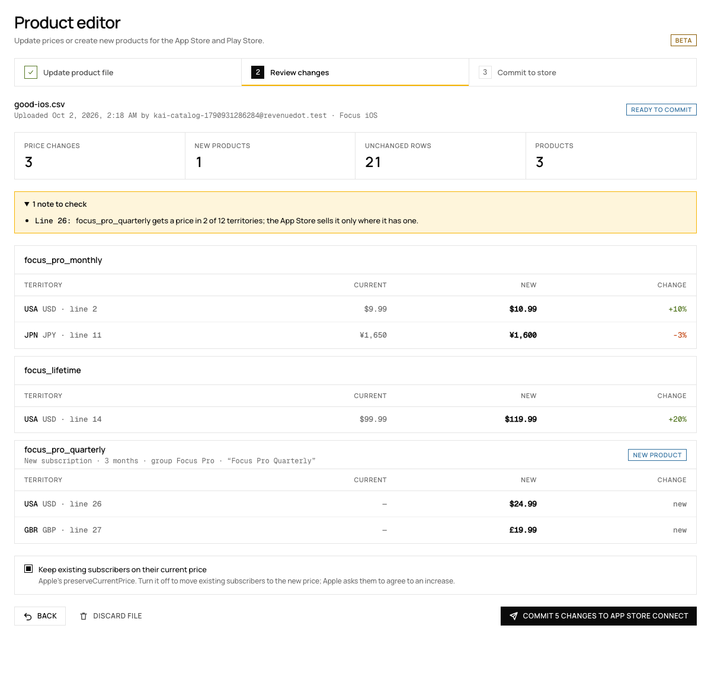
</details>

<details><summary><b>Can I sign users in with Firebase Auth and link them to their subscriptions without a backend?</b></summary>

Yes. Turn on Auth, add your Firebase project (or any OpenID Connect provider), and have the app send its ID token to `POST /v1/auth/login` with its public SDK key. RevenueDot verifies the token with the provider's published keys, signs the user in as their app user ID (moving purchases made before sign-in, like `logIn`), and returns an access token that reads customer info, attributes and in-app currency balances. See the [Auth guide](https://revenuedot.app/docs/guides/auth).
</details>

<details><summary><b>How do I stop sandbox and TestFlight purchases from unlocking premium for strangers?</b></summary>

Set **Project settings → General → Sandbox testing access** to "Allowlisted app user IDs" and list your testers, or to "Nobody". The server then gives no entitlements or in-app currency for sandbox purchases by anyone else; the purchases are still recorded and sent to webhooks. See [Project settings](https://revenuedot.app/docs/guides/project-settings#sandbox-testing-access).
</details>

<details><summary><b>How do I block a fraudulent user from premium features?</b></summary>

Block their app user ID under **Project settings → Blocked customers** or with `POST /v2/projects/{project_id}/blocked_customers`. Customer info then shows no entitlements on every platform and purchases credit no currency, while revenue and webhooks keep flowing. Unblock restores access at once.
</details>

<details><summary><b>Can I publish verified MRR and revenue numbers?</b></summary>

Yes. **Project settings → Verified Metrics** publishes a public page at `/verified/<slug>` with your production MRR, revenue, subscriptions, trials and customers, 28-day sparklines and a link-preview image. It shows totals only, never customers or sandbox data.
<details><summary><b>Can I see which customers are behind a chart, like RevenueCat's Customers tab?</b></summary>

Yes. Every chart has **Summary**, **Customers** and **Annotations** tabs, like RevenueCat's Charts v3 page ([RevenueCat docs](https://www.revenuecat.com/docs/dashboard-and-metrics/charts)). The Customers tab lists up to 100 customers behind the chart's current range, filters, segment and sandbox switch, each with their status, store, product and their part of the chart's number (their revenue, their MRR at the end of the range …), linked to the customer page. **Export all** downloads every one as CSV. The values add up to the chart; ad revenue from app users who never became customers is shown as its own amount. The API is `GET /v2/projects/{id}/charts/{chart_name}/customers` (`format=csv` for the export), and the docs publish the SQL behind revenue, new customers, new trials and MRR.

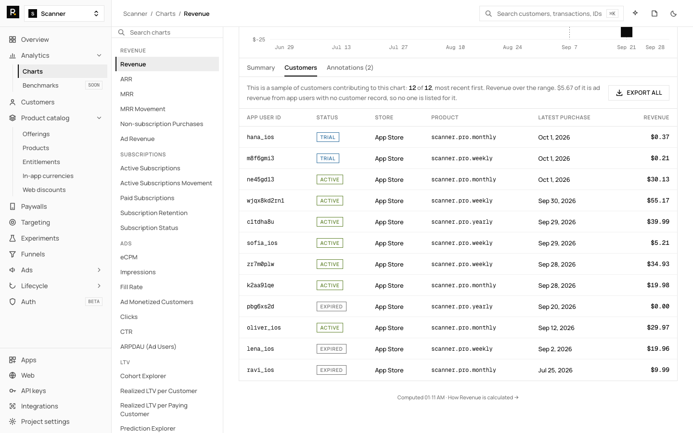
</details>

<details><summary><b>Can I mark launches and price changes on my revenue charts?</b></summary>

Yes. Click a day on any chart, or drag across a range, and press **+** to add an annotation with a title and a note. It shows on every chart of the project as a marker or a shaded band, with the title on hover, and in the chart's Annotations tab, where you can edit or delete it. Viewers see annotations but cannot change them. The API is `/v2/projects/{id}/chart_annotations`, and `include_annotations=true` on chart data returns them in RevenueCat's format.
</details>

<details><summary><b>How do I share a chart with an investor without giving them dashboard access?</b></summary>

Open the chart's **…** menu and choose **Share preview**. RevenueDot makes a public link to a picture of the chart as you see it (type, range, filters, segment), with a link preview image for Slack, X and email. It shows the numbers and labels only, never customer data. Revoke the link from the same menu and it stops working at once.

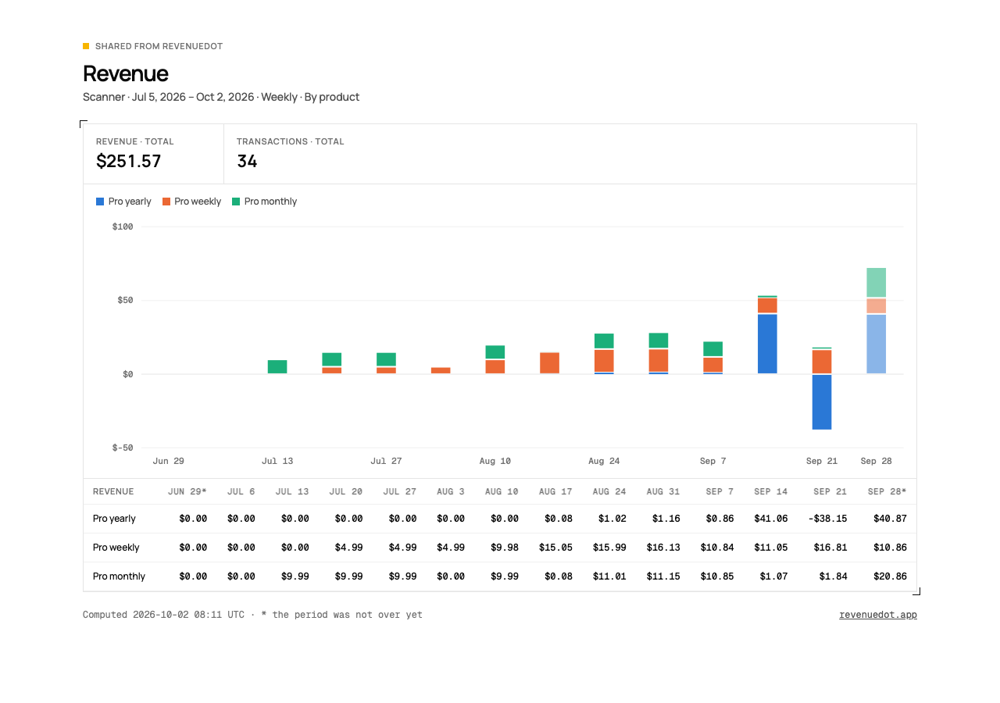
</details>

<details><summary><b>Does RevenueDot have an AI assistant like RevenueCat's Rico?</b></summary>

Yes. RevenueCat's dashboard has Rico, an AI advisor that answers questions about your subscription data ([RevenueCat docs](https://www.revenuecat.com/docs/tools/rico)). RevenueDot AI does the same from the dashboard's sparkle button or the Overview's Ask bar, reads any of the 43 charts, customers, the catalog, experiments and webhook health, and can grant access, create products, set the current offering, pause experiments or replay webhooks after you approve each change. Admins choose read and write, read only, or off per project. Self-hosted, it uses your own Anthropic or OpenAI key and keeps conversations in your Postgres. Guide: [RevenueDot AI](https://revenuedot.app/docs/guides/revenuedot-ai).
</details>

<details><summary><b>Does RevenueDot track ad revenue from AdMob, AppLovin MAX and ironSource?</b></summary>

Yes. The RevenueCat SDK's ad tracking (iOS and Android) sends impression-level ad revenue with the network, format, placement and ad unit to `POST /v1/events`; RevenueDot converts it to US dollars at each day's rate and shows ad revenue, impressions and eCPM next to subscription revenue on the Ads page and in the ad charts. See the [ads guide](https://revenuedot.app/docs/guides/ads).
</details>

<details><summary><b>How do I verify AdMob rewarded ads on the server?</b></summary>

Paste RevenueDot's callback URL (`https://api.revenuedot.app/v1/ads/admob/ssv` on Cloud) into the rewarded ad unit's server-side verification settings in AdMob, and pass the SDK's reward verification token to the ad. RevenueDot checks Google's ECDSA signature with [Google's published keys](https://developers.google.com/admob/android/ssv), grants the reward your rules name (in-app currency or temporary access), and the SDK's `pollRewardVerification` returns it.
</details>

<details><summary><b>Which RevenueCat integrations does RevenueDot support?</b></summary>

All 37 in [RevenueCat's catalogue](https://www.revenuecat.com/docs/integrations/third-party-integrations/amplitude), with the same event names and reserved attributes, plus BigQuery. Four partners (Superwall, Appstack, SplitMetrics Acquire, SolarEngine) publish no event API and receive RevenueCat's webhook body at the URL they give you, the way they connect to RevenueCat.
</details>

<details><summary><b>Can I sell my app's subscriptions on the web with RevenueDot?</b></summary>

Yes. Connect your own Stripe account on the Web page, create web products (RevenueDot creates them in Stripe), put them in an offering, and share a purchase link or publish a funnel. RevenueDot hosts the checkout page, records the purchase and gives the buyer a redemption link. Payments go straight to your Stripe account; RevenueDot takes no cut. Guide: [Sell on the web](https://revenuedot.app/docs/guides/web-billing).
</details>

<details><summary><b>How does a web purchase unlock the mobile app?</b></summary>

When the buyer was not signed in, the success page and an email give them a redemption link (`<your scheme>://redeem_web_purchase?redemption_token=…`). The RevenueCat SDK in your app parses it and calls `redeemWebPurchase`; RevenueDot attaches the purchase to the app's user and sends the PURCHASE_REDEEMED webhook. A purchase link opened with `?app_user_id=` skips this step. Guide: [Redemption links](https://revenuedot.app/docs/guides/redemption-links).
</details>

<details><summary><b>Does RevenueDot have web-to-app funnels like RevenueCat?</b></summary>

Yes. Funnels are no-code, multi-step web pages (quiz questions, information, email capture, the paywall and a success step) that you build in the dashboard with a live preview, or start with Build with AI, then publish to a URL on RevenueDot's domain or yours. Views, step drop-off, checkouts and purchases show in the funnel's analytics, and the events can go to your webhooks and analytics tools. Guide: [Funnels](https://revenuedot.app/docs/guides/funnels).
</details>

<details><summary><b>Can I self-host RevenueCat?</b></summary>

RevenueCat itself is closed source and cloud-only. RevenueDot is a self-hostable server that works with the RevenueCat SDK, so self-hosting means running RevenueDot with Docker and Postgres.
</details>

<details><summary><b>How do I migrate from RevenueCat without losing subscribers?</b></summary>

Import your RevenueCat export, forward App Store and Google Play notifications so both systems stay in sync, then ship an app update that sets the SDK's proxy URL. Current access is imported, so no subscriber loses access on switch day. See [Migrate from RevenueCat](#migrate-from-revenuecat-in-three-steps).
</details>

<details><summary><b>Do I have to change my app?</b></summary>

One line: set the SDK's proxy URL to `https://api.revenuedot.app` for RevenueDot Cloud, or to your own server. Offerings, purchases, entitlements and customer info work as before.
</details>

<details><summary><b>How do Google Play purchases migrate if RevenueCat doesn't export purchase tokens?</b></summary>

The importer looks up each purchase token from the order IDs in your export through Google's Orders API, using your own service account. Renewal notifications and a one-time `syncPurchases()` in the app fill any gaps.
</details>

<details><summary><b>Do Apple win-back offers work with RevenueDot?</b></summary>

Yes, with no app changes. The RevenueCat SDK checks eligibility and applies the offer with StoreKit on the device; win-back offers need no server signature. RevenueDot records the offer on the purchase, sends its id as `offer_code` in the `RENEWAL` webhook, exports it, and stores Apple's list of offers each lapsed customer may redeem. Purchases made in the App Store without opening the app arrive through App Store Server Notifications. See [Win-back offers](https://revenuedot.app/docs/guides/win-back-offers).
</details>

<details><summary><b>What happens to my customers' access if the server goes down?</b></summary>

Paying customers keep it. The RevenueCat SDKs cache a product-to-entitlement mapping and, when the server answers 5xx, grant entitlements on the device from the store's own purchase record. RevenueDot serves that mapping per app and keys it the way each SDK looks products up. See [Offline entitlements](https://revenuedot.app/docs/guides/offline-entitlements).
</details>

<details><summary><b>Does it support StoreKit 2, Expo and current Google Play Billing?</b></summary>

RevenueDot serves the same API the RevenueCat SDKs call, so it supports what they support: StoreKit 1 and 2, Expo through `react-native-purchases`, and current Google Play Billing versions.
</details>

<details><summary><b>Can I fight App Store refund abuse with a RevenueCat-compatible server?</b></summary>

Yes. When a customer asks Apple for a refund, Apple sends a `CONSUMPTION_REQUEST` and waits up to 12 hours for consumption information. RevenueDot's Refund Control answers it for you with Apple's [Send Consumption Information](https://developer.apple.com/documentation/appstoreserverapi/send-consumption-information-v1) endpoint: account age, spend, refunds, whether the purchase was used, and your refund preference from ordered policies (for example "prefer no refund for customers who renewed in the last 24 hours"). See the [Refund Control guide](https://revenuedot.app/docs/guides/refund-control).
</details>

<details><summary><b>Can RevenueDot win back subscribers whose card was declined?</b></summary>

Yes. When a renewal fails on the App Store, Google Play, Amazon or Stripe, **Lifecycle > Payment recovery** emails the subscriber from your app's name on your schedule (day 0, 3 and 7 by default) with one link to fix the payment: Apple's payment page, the Play Store subscription page, or a fresh Stripe customer portal session. When the store renews the subscription within the recovery window, the page counts that revenue as recovered. Webhooks still get the `BILLING_ISSUE` event as before. See the [Payment recovery guide](https://revenuedot.app/docs/guides/payment-recovery).
</details>

<details><summary><b>Do I have to paste a Stripe key to sell on the web?</b></summary>

No. Click **Connect with Stripe** on your Stripe app and allow RevenueDot in Stripe. Payments go straight to your own Stripe account, RevenueDot takes no fee on them, and your account's events reach RevenueDot without a webhook to set up. A restricted key still works if you prefer it. See [Connect with Stripe](https://revenuedot.app/docs/guides/stripe-connect).
</details>

<details><summary><b>How do I win back churned subscribers?</b></summary>

Three ways, all built: Apple's [win-back offers](https://revenuedot.app/docs/guides/win-back-offers) work with the RevenueCat SDK unchanged; a Customer Center offer catches customers as they cancel ([retention offers](https://revenuedot.app/docs/guides/retention)); and win-back campaigns email lapsed subscribers a link back to the store, once each, with clicks, unsubscribes and reactivations counted ([win-back campaigns](https://revenuedot.app/docs/guides/win-back-campaigns)).
</details>

<details><summary><b>Can I change the in-app Customer Center without releasing an app update?</b></summary>

Yes. The SDK's `CustomerCenterView` loads its configuration from your server each time it opens. Under **Lifecycle > Customer Center** you choose the paths on each screen and their order (restore, change plans, cancel, refund, a web page, an action in your app), ask why customers cancel with an offer per answer, set colours for light and dark mode and override any text in 33 languages, with a phone preview. Saved changes reach every app the next time the screen opens ([guide](https://revenuedot.app/docs/guides/customer-center)).
</details>

<details><summary><b>Where do Customer Center support requests go?</b></summary>

To your support email, with the customer's subscription details and Reply-To set to the customer, and to **Lifecycle > Support > Tickets** in the dashboard. Help desks such as Intercom and Zendesk can show the customer's subscriptions from the support summary endpoint ([guide](https://revenuedot.app/docs/guides/support-integrations)).
</details>

<details><summary><b>How much does RevenueDot cost?</b></summary>

Self-hosting is free, with no revenue share and no limits. RevenueDot Cloud is free up to $10,000 of tracked revenue a month. Cloud Standard is 0.5% of the tracked revenue above $10,000, never more than $999 a month; Cloud has billed real cards through Stripe since 2026-10-03 ([Cloud billing](https://revenuedot.app/docs/guides/cloud-billing)). RevenueCat charges 1% of all tracked revenue once an app passes $2,500 a month ([pricing](https://www.revenuecat.com/pricing)). Enterprise starts at $50,000 a year. Enterprise licences cover SSO, SCIM, custom roles, organizations, data location, audit retention, compliance exports and support.
</details>

<details><summary><b>Does RevenueDot support SAML single sign-on and SCIM provisioning?</b></summary>

Yes, with an Enterprise licence. Connect Okta, Microsoft Entra ID, Google Workspace or any SAML 2.0 or OpenID Connect provider, verify your email domain with a DNS TXT record, and optionally require single sign-on for that domain (owners keep a password for emergencies). SCIM 2.0 creates, updates and deactivates people from your identity provider and maps its groups to project roles; deactivating someone removes their access and signs them out at once. RevenueCat offers SSO and SCIM on its Enterprise plan through WorkOS ([RevenueCat SSO](https://www.revenuecat.com/docs/projects/sso)). See [Single sign-on](https://revenuedot.app/docs/guides/single-sign-on) and [SCIM](https://revenuedot.app/docs/guides/scim).
</details>

<details><summary><b>Can I create custom roles, for example a support agent who can refund but not edit the catalog?</b></summary>

Yes, with an Enterprise licence. A custom role is any set of the 33 API v2 permission scopes, for one project or every project of an organization, and the server checks it on every request, from the dashboard, RevenueDot AI and the API alike. RevenueCat has six fixed roles ([collaborators](https://www.revenuecat.com/docs/projects/collaborators)). See [Enterprise](https://revenuedot.app/docs/guides/enterprise).
</details>

<details><summary><b>Can I keep my customers' purchase data in the EU?</b></summary>

Self-hosted: yes, it stays wherever you run RevenueDot and its Postgres. RevenueDot Cloud records a region on each project and refuses requests that reach the wrong region, but it runs in the US today; an EU region is planned ([data location](https://revenuedot.app/docs/guides/data-location)). RevenueCat stores all data in the US ([DPA](https://www.revenuecat.com/dpa)).
</details>

<details><summary><b>Is it safe to validate purchases on my own server?</b></summary>

RevenueDot verifies every App Store transaction against Apple's signed JWS and the App Store Server API, and every Google Play purchase with the Play Developer API, on the server. Nothing is trusted from the device alone.
</details>

<details><summary><b>Does RevenueDot work with Amplitude, Mixpanel, Segment, AppsFlyer or Firebase like RevenueCat does?</b></summary>

Yes. Connect Slack, Segment, Amplitude, Mixpanel, PostHog, Firebase, BigQuery, AppsFlyer, Adjust or Meta under Integrations, and each purchase, trial, renewal, cancellation and refund is sent with the event names RevenueCat's integrations use (`rc_initial_purchase_event`, `rc_trial_started_event` ...) and the same reserved attributes (`$amplitudeDeviceId`, `$mixpanelDistinctId`, `$appsflyerId`, `$adjustId`, `$fbAnonId`). Dashboards built on RevenueCat's events keep working. See [the integrations guide](https://revenuedot.app/docs/guides/integrations).
</details>

<details><summary><b>Can I move from self-hosted RevenueDot to RevenueDot Cloud, or back?</b></summary>

Yes, with one command: `npx revenuedot move --from <old server> --to <new server>`, or **Project settings → Export and move** in the dashboard. The project keeps its ids, public SDK keys, secret API keys and webhook signing secrets, so apps and backends keep working. A dry run shows the rows per table first, the copy resumes if it stops, and every table's row count and checksum are verified before the switch. After it, the old server forwards SDK calls and store notifications to the new one until you update the proxy URL and the store notification URLs ([guide](https://revenuedot.app/docs/guides/move-projects)). RevenueCat has no way to move a project to another server.
</details>

<details><summary><b>Can I export all of a project's data?</b></summary>

Yes. **Export project** (or `npx revenuedot export`) writes every table the project owns, 64 in all, as JSON Lines with a manifest of row counts and checksums, and keeps it for 7 days. Store keys and webhook secrets are included only if you give a passphrase, and then they are encrypted with it. RevenueCat's scheduled exports cover transactions only ([scheduled data exports](https://www.revenuecat.com/docs/integrations/scheduled-data-exports)).
</details>

<details><summary><b>Can I export my subscription data to S3, BigQuery or my warehouse?</b></summary>

Yes. Scheduled data exports write CSV (one file per table) or Parquet files of transactions, customers, subscriptions, events, paywall events and the in-app currency ledger, with the columns you pick, to Amazon S3, Cloudflare R2, Google Cloud Storage or Azure Blob Storage, or email them as download links, every few hours, daily or weekly, and the transactions file uses the column names of RevenueCat's export. The BigQuery integration streams every event into a table as it happens.
</details>

<details><summary><b>Which stores are supported?</b></summary>

App Store, Google Play, the Amazon Appstore, the Samsung Galaxy Store, Roku, and web purchases from your own Stripe or Paddle account. Amazon, Stripe, Paddle, Roku and the Galaxy Store are tested against copies of each store's API; no real purchase in those stores has run yet. Guides: [Paddle](https://revenuedot.app/docs/guides/paddle), [Roku](https://revenuedot.app/docs/guides/roku), [Galaxy Store](https://revenuedot.app/docs/guides/galaxy-store).
</details>

<details><summary><b>Can I track Paddle Billing subscriptions with a RevenueCat-compatible server?</b></summary>

Yes. Create a Paddle app in RevenueDot with a Paddle API key, click Apply in Paddle so Paddle sends its notifications to RevenueDot, import your prices, and post each `sub_…` or `txn_…` from your backend to `POST /v1/receipts` with `X-Platform: paddle`. Products are Paddle price ids, as in [RevenueCat's Paddle integration](https://www.revenuecat.com/docs/web/integrations/paddle).

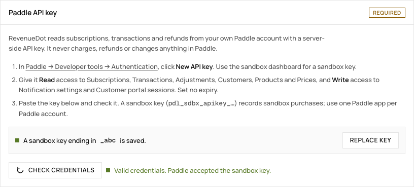
</details>

<details><summary><b>Does RevenueDot work with RevenueCat's Roku SDK?</b></summary>

Yes. Set the [Roku SDK's](https://github.com/RevenueCat/purchases-roku) `proxyUrl` to your RevenueDot server and use a Roku app's `roku_` key. RevenueDot validates each transaction with Roku Pay's web services and accepts Roku's signed push notifications at one URL per developer account.
</details>

<details><summary><b>Does RevenueDot support the Samsung Galaxy Store?</b></summary>

Yes. Build your Android app with the RevenueCat SDK's Galaxy module (`purchases-store-galaxy`, or `react-native-purchases-store-galaxy`) and a Galaxy app's `galx_` key. RevenueDot reads receipts and subscriptions from Samsung with a Seller Portal service account and applies Samsung's server notifications.
</details>

<details><summary><b>Can I use Amazon Appstore in-app purchases with a RevenueCat-compatible server?</b></summary>

Yes. Configure the RevenueCat Android SDK for Amazon (`AmazonConfiguration`) with an Amazon app's `amzn_` key and set the proxy URL. RevenueDot checks each receipt with Amazon's Receipt Verification Service using your shared key, and takes Amazon's Real-time Notifications through SNS with the signature checked. Setup: [Amazon Appstore guide](https://revenuedot.app/docs/guides/amazon-appstore).

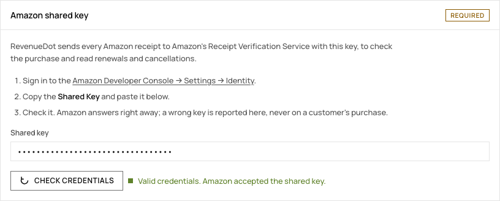
</details>

<details><summary><b>How do I unlock app features for customers who subscribed through Stripe on my website?</b></summary>

Create a Stripe app in RevenueDot with a restricted key from your own Stripe account, add RevenueDot's webhook URL in Stripe, and have your backend post each subscription or Checkout Session id to `POST /v1/receipts` with the customer's app user id (`X-Platform: stripe`), the same call RevenueCat documents ([RevenueCat: track external Stripe purchases](https://www.revenuecat.com/docs/web/integrations/stripe/track-external-purchases)). The same entitlements then unlock in your apps. Setup: [Stripe guide](https://revenuedot.app/docs/guides/stripe).

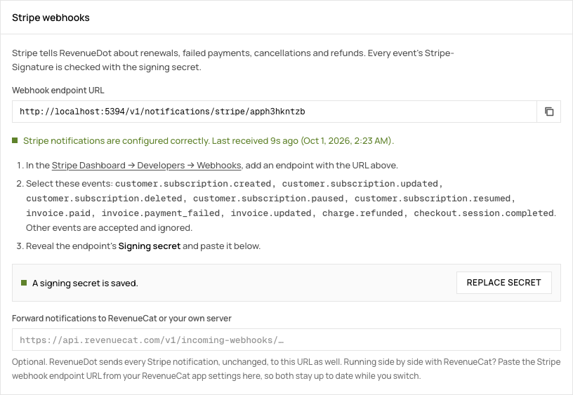
</details>

<details><summary><b>Does RevenueDot have RevenueCat's charts, like MRR, churn and trial conversion?</b></summary>

Yes. All 43 built-in charts are in the dashboard and at `GET /v2/projects/{project_id}/charts/{chart_name}` with RevenueCat's chart names, parameters and response shape. They follow RevenueCat's definitions: sandbox excluded, USD at the purchase-date rate, refunds on the refund date. The [charts guide](https://revenuedot.app/docs/guides/charts) explains every chart and publishes the SQL behind the core ones.
</details>

<details><summary><b>Does RevenueDot support RevenueCat paywalls (Paywalls V2) and RevenueCatUI's PaywallView?</b></summary>

Yes. RevenueDot serves paywalls in the components format that RevenueCatUI's `PaywallView` renders, in the offerings response and in remote config (which iOS SDK 5.83 and later read). Build them from ten templates, in a visual editor with all 17 component types (text, image, icon, stack, button, package, purchase button, sticky footer, timeline, tabs and their controls, carousel, video, countdown, web view), or with "Generate with AI". The server refuses to publish a paywall the SDK could not decode. See the [paywalls guide](https://revenuedot.app/docs/guides/paywalls).
</details>

<details><summary><b>Can I generate a paywall with AI on a self-hosted server?</b></summary>

Yes, with your own key: set `AI_GATEWAY_API_KEY` (Vercel AI Gateway, model `openai/gpt-6-luna`; it then runs every AI feature, RevenueDot AI included), `OPENAI_API_KEY` or `ANTHROPIC_API_KEY`. RevenueDot Cloud uses the same gateway. The model first reads your description into a brief, then designs the paywall; a checker holds the design to the brief (plans, trial, prices, contrast) and sends problems back for a fix before you see it.
</details>

<details><summary><b>What license is it under?</b></summary>

The server and dashboard are AGPL-3.0. The SDKs, CLI, MCP server and agent skills are MIT. The `ee/` folder is under the RevenueDot Enterprise License. See [LICENSING.md](LICENSING.md).
</details>

## Contributing

Please read [CONTRIBUTING.md](CONTRIBUTING.md). Every feature starts with a spec in `prd/`, and changes to anything the RevenueCat SDKs call must pass the contract tests. Outside contributions need a signed [CLA](.github/CLA.md).

## Security

Please report vulnerabilities privately through GitHub's **Report a vulnerability** button in the Security tab, or email security@revenuedot.app. See [SECURITY.md](https://github.com/revenuedot/.github/blob/main/SECURITY.md).

## License

AGPL-3.0 for this repository, with the `ee/` folder under the [RevenueDot Enterprise License](ee/LICENSE). See [LICENSING.md](LICENSING.md) and [TRADEMARKS.md](TRADEMARKS.md).

<sub>RevenueDot is not affiliated with, endorsed by or sponsored by RevenueCat, Inc. "RevenueCat" is a trademark of RevenueCat, Inc., used here only to describe compatibility. Other product names are trademarks of their owners.</sub>
