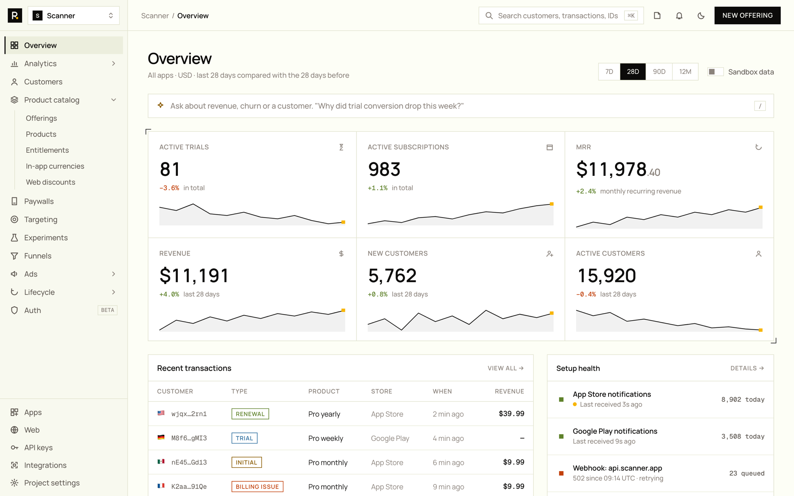
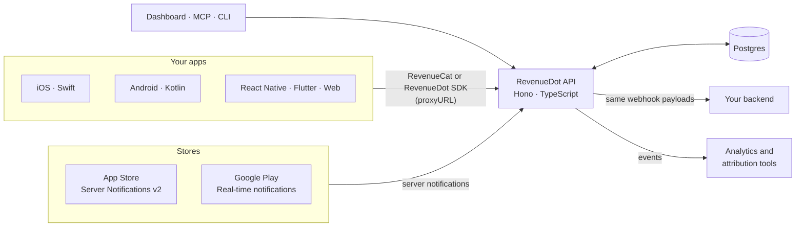
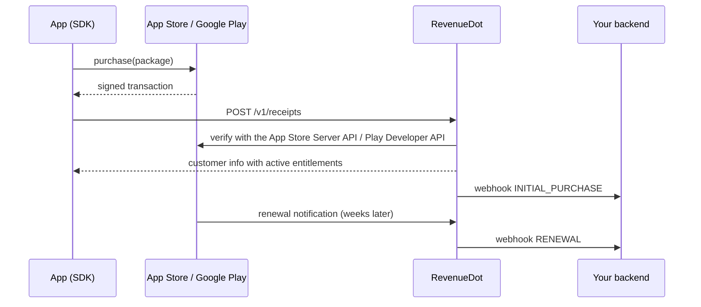

<div align="center">

<h1>
<picture>
  <source media="(prefers-color-scheme: dark)" srcset="brand/kit/wordmark/revenuedot-lockup-white.svg">
  
</picture>
</h1>

### The open-source RevenueCat alternative

**Self-hosted in-app purchase and subscription backend for iOS, Android, React Native, Flutter and the web.**<br>
Works with the RevenueCat SDK you already ship: change one line, keep your app code, keep your customers.

[Website](https://revenuedot.app) · [Migrate from RevenueCat](#migrate-from-revenuecat-in-three-steps) · [SDKs](#sdks) · [Compatibility](#compatibility) · [Roadmap](#roadmap) · [FAQ](#faq)

[](LICENSING.md)
[](#sdks)
[](prd/SCOPE.md)
[](#compatibility)
[](#self-host)
[](https://github.com/revenuedot/revenuedot/stargazers)

<br>

<picture>
  <source media="(prefers-color-scheme: dark)" srcset="docs/assets/dashboard-dark.png">
  
</picture>

<sub>Dashboard design preview. Example data.</sub>

</div>

> [!IMPORTANT]
> **RevenueDot is pre-alpha and built in the open.** Nothing here is production-ready yet. Star or watch the repo to follow along; the build plan is in [prd/SCOPE.md](prd/SCOPE.md).

## In one minute

- **What it is:** an open-source server that validates App Store and Google Play purchases, keeps every customer's entitlements up to date, and sends webhooks to your backend.
- **Why it's different:** it speaks the same API as RevenueCat, so apps already using the RevenueCat SDK switch by changing one setting. No purchase code to rewrite.
- **How you run it:** `docker compose up` on your own servers, free forever, or RevenueDot Cloud when you'd rather not run it.
- **Who it's for:** subscription apps that want to own their purchase data, stop paying a share of revenue, or keep data in a specific region.

## Contents

- [Why teams switch](#why-teams-switch)
- [How it works](#how-it-works)
- [Migrate from RevenueCat in three steps](#migrate-from-revenuecat-in-three-steps)
- [Features](#features)
- [SDKs](#sdks)
- [Compatibility](#compatibility)
- [RevenueDot compared](#revenuedot-compared)
- [Self-host](#self-host)
- [Built for AI agents](#built-for-ai-agents)
- [Repository map](#repository-map)
- [Roadmap](#roadmap)
- [FAQ](#faq)
- [Contributing](#contributing) · [Security](#security) · [License](#license)

## Why teams switch

| | What changes |
|---|---|
| **No revenue share when you self-host** | RevenueCat charges 1% of tracked revenue above $2,500 a month ([pricing](https://www.revenuecat.com/pricing)). At $50,000 a month that is $475 a month; at $500,000 a month it is $4,975 a month. Self-hosted RevenueDot costs your server bill. |
| **Your data, your cloud, your region** | Purchases, customers and receipts live in your own Postgres, in the region your customers and your lawyers need. |
| **Same API, no rewrite** | The same SDK calls, the same customer info, the same webhook payloads. Your app and your backend handlers keep working. |
| **A safe migration** | Import your catalog, customers and history in one command, run both systems side by side, then switch when you're sure. |
| **Open source** | Read, audit and change the code that decides who has access to your app. |
| **Built for AI agents** | An MCP server and agent skills let Claude, ChatGPT, Codex and Cursor set it up and run it for you. |

## How it works



**A purchase, end to end:**



One TypeScript codebase runs two ways: in Docker next to your own Postgres, or on Cloudflare Workers with Hyperdrive in RevenueDot Cloud. The subscription logic is a set of pure functions, so both give the same answers.

## Migrate from RevenueCat in three steps

1. **Import.** Run the importer on your own machine with your own RevenueCat secret API key. It brings over products, entitlements, offerings, customers, attributes and purchase history. Your existing public API keys keep working, and current access is imported so nobody loses access on switch day.
   ```bash
   npx revenuedot import --from-revenuecat --rc-key sk_... --rc-project <RevenueCat project id> \
     --to https://api.revenuedot.app --to-key <RevenueDot secret key>
   ```
2. **Run side by side.** Point App Store and Google Play notifications at RevenueDot. It forwards every notification to RevenueCat, so both systems stay accurate while you compare them.
3. **Switch.** Ship an app update that sets the proxy URL. When most users are on the new version, turn RevenueCat off.

<details>
<summary><b>The one line, for every SDK</b></summary>

```swift
// iOS, macOS, tvOS, watchOS, visionOS (Swift): before configure
Purchases.proxyURL = URL(string: "https://api.revenuedot.app")!
Purchases.configure(withAPIKey: "appl_...")
```

```kotlin
// Android (Kotlin): before configure
Purchases.proxyURL = URL("https://api.revenuedot.app")
```

```ts
// React Native and Expo
await Purchases.setProxyURL("https://api.revenuedot.app");
```

```dart
// Flutter (iOS and Android)
await Purchases.setProxyURL("https://api.revenuedot.app");
```

```ts
// Capacitor and Ionic
await Purchases.setProxyURL({ url: "https://api.revenuedot.app" });
```

```kotlin
// Kotlin Multiplatform
Purchases.proxyURL = "https://api.revenuedot.app"
```

```ts
// Web (purchases-js)
Purchases.configure({ apiKey: "rcb_...", appUserId, httpConfig: { proxyURL: "https://api.revenuedot.app" } });
```

Unity: set the `proxyURL` field on the `Purchases` component. Cordova: `Purchases.setProxyURL(url)`. Self-hosting? Use your own server's URL.

</details>

> [!NOTE]
> With the stock RevenueCat SDK, turn off its response-signature check (it would report every RevenueDot response as unverified), or use a [RevenueDot SDK fork](#sdks), which carries RevenueDot's signing key and keeps all SDK traffic on your server.

## Features

| Area | What you get | Status |
|---|---|---|
| **Stores** | App Store (StoreKit 1 and 2, App Store Server API, Server Notifications v2) and Google Play (Play Developer API, real-time notifications, acknowledgement within 3 days) | Tier 1 · building |
| **Access** | Entitlements, offerings, packages, anonymous IDs, `logIn`/`logOut`, aliasing, restore and transfer rules, promotional access, grace periods, billing retry, refunds, upgrades and downgrades | Tier 1 · building |
| **Backend** | RevenueCat-compatible REST API v1 and v2 core, webhooks with the same payloads, signed deliveries, retries and replay | Tier 1 · building |
| **Migration** | One-command importer, Google purchase-token recovery through Google's Orders API, notification forwarding for a side-by-side run | Tier 1 · building |
| **Dashboard** | Overview metrics, customers and their history, catalog, webhooks, API keys, setup health, SDK compatibility | Tier 1 · designing |
| **Run it anywhere** | `docker compose up` with Postgres; the same code in RevenueDot Cloud | Tier 1 · building |
| **SDKs** | MIT forks of all ten RevenueCat SDKs with the same classes and methods | Tier 1 · forked |
| **AI-native** | MCP server, agent skills, `llms.txt` | Tier 1 · scaffolded |
| **Growth** | 42 charts, paywalls, experiments, targeting, integrations, virtual currencies, Customer Center | Tier 2 · planned |
| **Enterprise** | SSO/SAML, SCIM, audit logs, EU and US data regions, high-availability self-host, SLA | Tier 3 · planned |

## SDKs

Keep the RevenueCat SDK you already ship, or switch to our MIT forks. They keep RevenueCat's class and method names (`Purchases`, `CustomerInfo`, `Offerings`), so the swap is a package change.

| Platform | Language | Repository | Proxy-URL migration |
|---|---|---|---|
| iOS, macOS, tvOS, watchOS, visionOS | Swift | [revenuedot/purchases-ios](https://github.com/revenuedot/purchases-ios) | Yes |
| Android | Kotlin | [revenuedot/purchases-android](https://github.com/revenuedot/purchases-android) | Yes |
| React Native and Expo | TypeScript | [revenuedot/react-native-purchases](https://github.com/revenuedot/react-native-purchases) | Yes |
| Flutter | Dart | [revenuedot/purchases-flutter](https://github.com/revenuedot/purchases-flutter) | Yes on mobile |
| Web | TypeScript | [revenuedot/purchases-js](https://github.com/revenuedot/purchases-js) | Yes |
| Capacitor and Ionic | TypeScript | [revenuedot/purchases-capacitor](https://github.com/revenuedot/purchases-capacitor) | Yes on native |
| Kotlin Multiplatform | Kotlin | [revenuedot/purchases-kmp](https://github.com/revenuedot/purchases-kmp) | Yes |
| Unity | C# | [revenuedot/purchases-unity](https://github.com/revenuedot/purchases-unity) | Yes |
| Cordova | TypeScript | [revenuedot/cordova-plugin-purchases](https://github.com/revenuedot/cordova-plugin-purchases) | Yes |
| Shared layer for the cross-platform SDKs | Kotlin, Swift | [revenuedot/purchases-hybrid-common](https://github.com/revenuedot/purchases-hybrid-common) | n/a |

## Compatibility

RevenueDot is tested against the RevenueCat SDKs' own test fixtures (94 request and response samples, plus 21 webhook samples) and RevenueCat's published OpenAPI files. A change that breaks one of them does not merge.

<details>
<summary><b>SDK endpoints (the API your app calls)</b></summary>

| Endpoint | What the SDK uses it for |
|---|---|
| `GET /v1/subscribers/{app_user_id}` | Customer info and active entitlements |
| `GET /v1/subscribers/{app_user_id}/offerings` | The offerings and packages to show on the paywall |
| `POST /v1/receipts` | Every purchase and restore |
| `POST /v1/subscribers/identify` | `logIn` |
| `POST /v1/subscribers/{app_user_id}/attributes` | Customer attributes such as `$email` |
| `GET /v1/product_entitlement_mapping` | Offline entitlements |
| `POST /v1/config/app` · `POST /v1/events` · `POST /v1/diagnostics` | Configuration and SDK events |

The full catalogue of 37 SDK endpoints, with request and response shapes, lives in the contract tests.

</details>

<details>
<summary><b>Webhook events (same names and payloads as RevenueCat)</b></summary>

`INITIAL_PURCHASE` · `RENEWAL` · `CANCELLATION` · `UNCANCELLATION` · `NON_RENEWING_PURCHASE` · `SUBSCRIPTION_PAUSED` · `EXPIRATION` · `BILLING_ISSUE` · `PRODUCT_CHANGE` · `SUBSCRIPTION_EXTENDED` · `REFUND_REVERSED` · `TRANSFER` · `TEMPORARY_ENTITLEMENT_GRANT` · `VIRTUAL_CURRENCY_TRANSACTION` · `INVOICE_ISSUANCE` · `EXPERIMENT_ENROLLMENT` · `PURCHASE_REDEEMED` · `PRICE_INCREASE_CONSENT_REQUIRED` · `PRICE_INCREASE_CONSENT_APPROVED` · `TEST`

Delivered at least once, with an `Authorization` header and an HMAC signature, retried 5 times.

</details>

<details>
<summary><b>REST API</b></summary>

- **v1:** all 15 endpoints (subscribers, receipts, attributes, offerings, promotional entitlements, refunds and more).
- **v2:** customers, subscriptions, purchases, entitlements, offerings, packages, products, apps and projects in Tier 1; the rest of the 128 endpoints in Tier 2. Same shapes, pagination and error format.

</details>

## RevenueDot compared

| | RevenueDot | RevenueCat | Superwall | Adapty | Qonversion |
|---|---|---|---|---|---|
| Open-source server | **Yes (AGPL-3.0)** | No | No | No | No |
| Self-host | **Yes, Docker and Postgres** | No | No | No | No |
| Works with the RevenueCat SDK | **Yes, one line** | Yes | Own SDK | Own SDK | Own SDK |
| Price | **Free self-hosted**; cloud with a free plan | Free to $2.5K/month, then 1% of tracked revenue | Infrastructure free; paywalls 1% above $10K/month | Free to $5K/month, then 1% | Free to $7K/month, then 0.8% |
| Data location | **Your cloud, your region** | Vendor cloud | Vendor cloud | Vendor cloud | Vendor cloud |

<sub>Competitor prices from their public pricing pages, checked September 2026: [RevenueCat](https://www.revenuecat.com/pricing), [Superwall](https://superwall.com/pricing), [Adapty](https://adapty.io/pricing/), [Qonversion](https://qonversion.io/pricing).</sub>

## Self-host

```bash
git clone https://github.com/revenuedot/revenuedot && cd revenuedot
cp .env.example .env        # add your App Store and Google Play credentials
docker compose up -d        # API, dashboard and Postgres
```

<sub>Planned for the first release. What you run yourself: the server, Postgres, backups and upgrades. RevenueDot Cloud adds failover, point-in-time recovery, global edge caching, monitoring and support.</sub>

## Built for AI agents

- **[MCP server](https://github.com/revenuedot/mcp):** manage offerings, look up customers, grant access and check webhooks from Claude, ChatGPT or Cursor.
- **[Agent skills](https://github.com/revenuedot/agent-skills):** `migrate-from-revenuecat`, `add-subscriptions` and `self-host`, for Claude Code, Codex and Cursor.
- **Docs for machines:** `llms.txt` and Markdown docs, so assistants answer RevenueDot questions correctly.

## Repository map

```
revenuedot/
├── apps/
│   ├── server/        RevenueCat-compatible API (Hono, TypeScript)
│   └── dashboard/     Web dashboard
├── packages/
│   ├── core/          Subscription state machine and entitlement engine (pure functions)
│   ├── stores/        App Store, Google Play, Amazon and Stripe adapters
│   ├── db/            Postgres schema and migrations
│   ├── contract/      Contract tests from the RevenueCat SDK fixtures
│   └── cli/           npx revenuedot (import, init, keys) · MIT
├── ee/                Enterprise features · RevenueDot Enterprise License
├── brand/             Logo, icons, social cards and the generator
├── prd/               Specs, one folder per feature
└── docs/              Architecture, status and README assets
```

## Roadmap

- **Tier 1 · switch in an afternoon:** SDK-compatible API, App Store and Google Play, entitlements, identity, catalog, webhooks, REST API, importer, dashboard, Docker self-host, cloud, all SDK forks, MCP and docs.
- **Tier 2 · head to head:** full v2 API, all webhook events, top integrations, 42 charts, paywalls, experiments, targeting, Customer Center, virtual currencies, Amazon and Stripe, in-app AI agent.
- **Tier 3 · enterprise:** SSO, SCIM, data regions, high-availability self-host, SLA, web checkout, revenue recovery.

Details and acceptance criteria: [prd/SCOPE.md](prd/SCOPE.md). Progress: [docs/STATUS.md](docs/STATUS.md).

## FAQ

<details><summary><b>Is RevenueDot an open-source alternative to RevenueCat?</b></summary>

Yes. RevenueDot is an open-source (AGPL-3.0) backend for in-app purchases and subscriptions that implements the API the RevenueCat SDKs call, so it can replace RevenueCat without changing your app's purchase code.
</details>

<details><summary><b>Can I self-host RevenueCat?</b></summary>

RevenueCat itself is closed source and cloud-only. RevenueDot is a self-hostable server that works with the RevenueCat SDK, so self-hosting means running RevenueDot with Docker and Postgres.
</details>

<details><summary><b>How do I migrate from RevenueCat without losing subscribers?</b></summary>

Import your RevenueCat export, forward App Store and Google Play notifications so both systems stay in sync, then ship an app update that sets the SDK's proxy URL. Current access is imported, so no subscriber loses access on switch day. See [Migrate from RevenueCat](#migrate-from-revenuecat-in-three-steps).
</details>

<details><summary><b>Do I have to change my app?</b></summary>

One line: set the SDK's proxy URL to your RevenueDot server. Offerings, purchases, entitlements and customer info work as before.
</details>

<details><summary><b>How do Google Play purchases migrate if RevenueCat doesn't export purchase tokens?</b></summary>

The importer looks up each purchase token from the order IDs in your export through Google's Orders API, using your own service account. Renewal notifications and a one-time `syncPurchases()` in the app fill any gaps.
</details>

<details><summary><b>Does it support StoreKit 2, Expo and current Google Play Billing?</b></summary>

RevenueDot serves the same API the RevenueCat SDKs call, so it supports what they support: StoreKit 1 and 2, Expo through `react-native-purchases`, and current Google Play Billing versions.
</details>

<details><summary><b>How much does RevenueDot cost?</b></summary>

Self-hosting is free. RevenueDot Cloud will have a free plan for small apps. Enterprise licenses cover SSO, audit logs, data regions and support.
</details>

<details><summary><b>Is it safe to validate purchases on my own server?</b></summary>

RevenueDot verifies every App Store transaction against Apple's signed JWS and the App Store Server API, and every Google Play purchase with the Play Developer API, on the server. Nothing is trusted from the device alone.
</details>

<details><summary><b>Which stores are supported?</b></summary>

App Store and Google Play first. Amazon and Stripe web subscriptions in Tier 2; Paddle and Roku in Tier 3.
</details>

<details><summary><b>What license is it under?</b></summary>

The server and dashboard are AGPL-3.0. The SDKs, CLI, MCP server and agent skills are MIT. The `ee/` folder is under the RevenueDot Enterprise License. See [LICENSING.md](LICENSING.md).
</details>

## Contributing

Please read [CONTRIBUTING.md](CONTRIBUTING.md). Every feature starts with a spec in `prd/`, and changes to anything the RevenueCat SDKs call must pass the contract tests. Outside contributions need a signed [CLA](.github/CLA.md).

## Security

Please report vulnerabilities privately through GitHub's **Report a vulnerability** button in the Security tab. See [SECURITY.md](https://github.com/revenuedot/.github/blob/main/SECURITY.md).

## License

AGPL-3.0 for this repository, with the `ee/` folder under the [RevenueDot Enterprise License](ee/LICENSE). See [LICENSING.md](LICENSING.md) and [TRADEMARKS.md](TRADEMARKS.md).

<sub>RevenueDot is not affiliated with, endorsed by or sponsored by RevenueCat, Inc. "RevenueCat" is a trademark of RevenueCat, Inc., used here only to describe compatibility. Other product names are trademarks of their owners.</sub>
