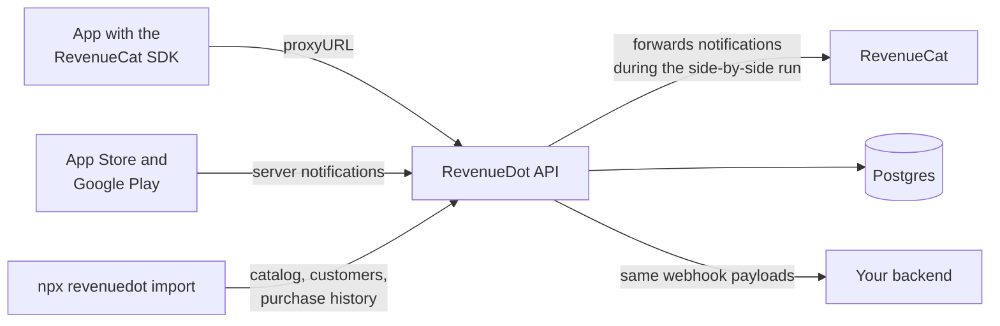

<div align="center">

# RevenueDot

### The open-source RevenueCat alternative

**Self-hosted backend for in-app purchases and subscriptions on the App Store and Google Play.**<br>
Works with the RevenueCat SDK: change one line, keep your app code, keep your customers.

[Website](https://revenuedot.app) · [Scope and roadmap](prd/SCOPE.md) · [Design](DESIGN.md) · [SDKs](#sdks) · [FAQ](#faq)


</div>

> **Status: pre-alpha.** RevenueDot is being built in the open. Nothing here is ready for production yet. Star or watch the repo to follow along, and see [prd/SCOPE.md](prd/SCOPE.md) for what ships first.

## What is RevenueDot?

RevenueDot is open-source subscription infrastructure for mobile apps. It validates App Store and Google Play purchases, keeps each customer's entitlements up to date, and sends webhooks to your backend. You can run it on your own servers for free, or use RevenueDot Cloud.

It speaks the same API as RevenueCat. Apps that already use the RevenueCat SDK point it at RevenueDot with one setting, and everything else in the app stays the same:

```swift
// iOS (Swift)
Purchases.proxyURL = URL(string: "https://api.revenuedot.app")!
Purchases.configure(withAPIKey: "appl_...")
```

```kotlin
// Android (Kotlin)
Purchases.proxyURL = URL("https://api.revenuedot.app")
```

```ts
// React Native
await Purchases.setProxyURL("https://api.revenuedot.app");
```

Point `proxyURL` at your own server when you self-host.

## Why teams switch

- **No revenue share when you self-host.** Your purchase data and your costs stay yours.
- **Your data, your region.** Run it in your own cloud account, next to your database, in the region your customers and lawyers need.
- **Same API, no rewrite.** The same SDK calls, the same customer info, the same webhook payloads, so your app code and backend handlers keep working.
- **Safe migration.** Import your catalog, customers and purchase history in one command, run both systems side by side, then switch.
- **Open source.** Read the code that decides who has access to your app, and change it.
- **Built for AI agents.** An MCP server and agent skills let Claude, ChatGPT, Codex and Cursor set it up and run it.

## Features

| | Feature | Status |
|---|---|---|
| **Stores** | App Store (StoreKit 1 and 2, App Store Server Notifications v2), Google Play (Billing, real-time notifications) | Tier 1, in progress |
| **Access** | Entitlements, offerings, packages, anonymous IDs, `logIn` and aliasing, restore and transfer rules, promotional access | Tier 1 |
| **Backend** | RevenueCat-compatible REST API v1 and v2, webhooks with the same event payloads, signed deliveries and retries | Tier 1 |
| **Migration** | `npx revenuedot import` from RevenueCat, Google purchase-token recovery, notification forwarding for a side-by-side run | Tier 1 |
| **Dashboard** | Overview metrics (MRR, revenue, active subscriptions, trials), customers and their history, catalog, webhooks, API keys | Tier 1 |
| **Self-host** | `docker compose up` with Postgres; the cloud runs the same code on Cloudflare Workers | Tier 1 |
| **Growth** | Charts, paywalls, experiments, targeting, integrations, virtual currencies | Tier 2 |
| **Enterprise** | SSO/SAML, SCIM, audit logs, EU and US data regions, high-availability self-host | Tier 3 |

## How migration works



1. **Import.** Run the importer with your own RevenueCat export. It brings over your products, entitlements, offerings, customers and purchase history, and your existing public API keys keep working.
2. **Run side by side.** Point App Store and Google Play notifications at RevenueDot; it forwards them to RevenueCat, so both stay accurate.
3. **Switch.** Ship an app update that sets `proxyURL`. When most users are on it, turn RevenueCat off.

## SDKs

Use the RevenueCat SDK you already have, or our MIT forks with the same classes and methods:

| Platform | Repository |
|---|---|
| iOS, macOS, tvOS, watchOS, visionOS (Swift) | [revenuedot/purchases-ios](https://github.com/revenuedot/purchases-ios) |
| Android (Kotlin) | [revenuedot/purchases-android](https://github.com/revenuedot/purchases-android) |
| React Native and Expo | [revenuedot/react-native-purchases](https://github.com/revenuedot/react-native-purchases) |
| Flutter | [revenuedot/purchases-flutter](https://github.com/revenuedot/purchases-flutter) |
| Web (TypeScript) | [revenuedot/purchases-js](https://github.com/revenuedot/purchases-js) |
| Capacitor and Ionic | [revenuedot/purchases-capacitor](https://github.com/revenuedot/purchases-capacitor) |
| Kotlin Multiplatform | [revenuedot/purchases-kmp](https://github.com/revenuedot/purchases-kmp) |
| Unity | [revenuedot/purchases-unity](https://github.com/revenuedot/purchases-unity) |
| Cordova | [revenuedot/cordova-plugin-purchases](https://github.com/revenuedot/cordova-plugin-purchases) |

AI tooling: [revenuedot/mcp](https://github.com/revenuedot/mcp) (MCP server) and [revenuedot/agent-skills](https://github.com/revenuedot/agent-skills) (skills for Claude Code, Codex and Cursor).

## Architecture

One TypeScript codebase ([Hono](https://hono.dev)) with Postgres. It runs in Docker on your servers, or on Cloudflare Workers with Hyperdrive in RevenueDot Cloud. The subscription logic is a set of pure functions, so both give the same answers. Compatibility with the RevenueCat SDKs is enforced by contract tests built from the SDKs' own test data.

## FAQ

**Is RevenueDot an open-source alternative to RevenueCat?**
Yes. RevenueDot is an open-source (AGPL-3.0) backend for in-app purchases and subscriptions that implements the API the RevenueCat SDKs call, so it can replace RevenueCat without changing your app's purchase code.

**Can I self-host RevenueCat?**
RevenueCat itself is closed source and cloud-only. RevenueDot is a self-hostable server that works with the RevenueCat SDK, so self-hosting means running RevenueDot with Docker and Postgres.

**Do I have to change my app to use RevenueDot?**
One line: set the SDK's proxy URL to your RevenueDot server. Offerings, purchases, entitlements and customer info work as before. Turn off the SDK's signature verification, or use a RevenueDot SDK fork, which carries RevenueDot's signing key.

**Will I lose purchase history or subscribers when I switch?**
No. The importer brings over customers and purchase history, current access is imported so nobody loses access on switch day, and notification forwarding keeps RevenueCat accurate while both run.

**Which stores are supported?**
App Store and Google Play first. Amazon and Stripe web subscriptions come in Tier 2; Paddle and Roku in Tier 3.

**How much does it cost?**
Self-hosting is free. RevenueDot Cloud will have a free plan for small apps. Enterprise licenses cover SSO, audit logs, data regions and support.

**What license is it under?**
The server and dashboard are AGPL-3.0, the SDKs, CLI, MCP server and agent skills are MIT, and the `ee/` folder is under the RevenueDot Enterprise License. See [LICENSING.md](LICENSING.md).

## Contributing

Please read [CONTRIBUTING.md](CONTRIBUTING.md). Every feature starts with a spec in `prd/`, and changes to anything the RevenueCat SDKs call must pass the contract tests. Outside contributions need a signed [CLA](.github/CLA.md).

## License

AGPL-3.0 for this repository, with the `ee/` folder under the [RevenueDot Enterprise License](ee/LICENSE). See [LICENSING.md](LICENSING.md) and [TRADEMARKS.md](TRADEMARKS.md).

RevenueDot is not affiliated with, endorsed by or sponsored by RevenueCat, Inc. "RevenueCat" is a trademark of RevenueCat, Inc., used here only to describe compatibility.
