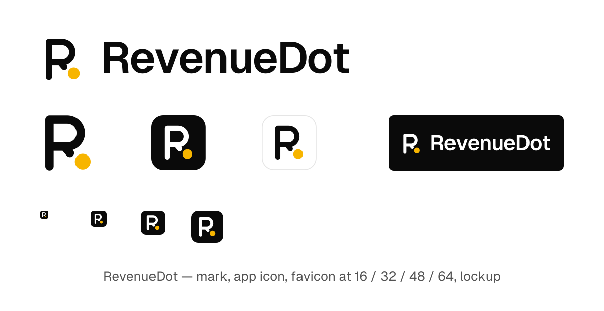

# RevenueDot brand

**The mark is an R whose leg is finished by a gold dot.** A short stub of the leg leaves the bowl and the dot completes it, so it reads as R at every size and says the name: Revenue, then the dot.

## Geometry (32-unit grid)
- Letter: `M8.5 25.5V6.5h7.2a5.5 5.5 0 010 11H8.5M14.6 17.5l2.2 2.6`, stroke 3.4, round caps and joins, in the ink colour.
- Dot: circle at (22, 23.6), radius 3.2, always gold `#F7B500`.

## Colours
- Ink `#0A0A0A` on light, `#FFFFFF` on dark. The dot is always gold.
- App icon: near-black tile, white R, gold dot. The light tile has a hairline border.

## Files (`kit/`, generated)
- `mark/`, `icon/`, `favicon/` (svg, ico, apple-touch, android, webmanifest), `wordmark/` (outlined wordmark and lockup, both polarities), `social/` (1200×630).
- Regenerate: `cd scripts/brand && npm i sharp png-to-ico opentype.js@1.3.4 geist && node generate-brand.cjs --out ../../brand/kit`.

## Rules
- Never recolour the dot, never move it, never draw the R without it.
- Minimum size 16px (use the tile below 24px). Clear space: the dot's diameter on every side.
- Wordmark: "RevenueDot", Geist Semibold, tracking −0.035em. One word, capital R and D.
